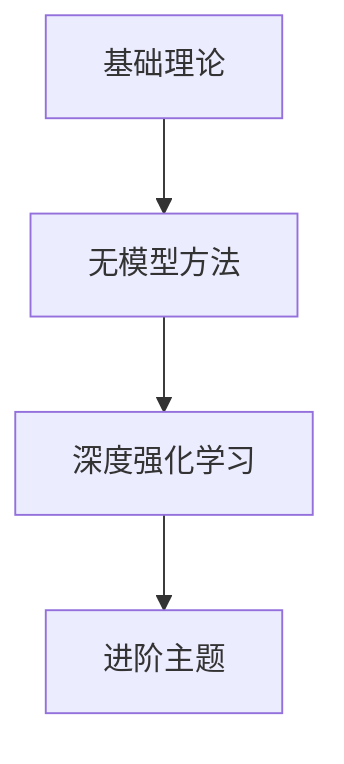

# 强化学习系统学习计划 (Reinforcement Learning Study Plan)

## 学习路线图

---

## 第一阶段：基础理论（第1-7天）

| 天数 | 主题 | 核心内容 |
|------|------|----------|
| **Day 1** | 引言与 MDP | RL 定义、智能体-环境交互、马尔可夫决策过程、回报与价值函数 |
| Day 2 | 贝尔曼方程 | 贝尔曼期望方程、贝尔曼最优方程、最优性原理 |
| Day 3 | 动态规划 | 策略评估、策略迭代、价值迭代、广义策略迭代 |
| Day 4 | 蒙特卡洛方法 | MC 预测、MC 控制、探索与利用、ε-贪心策略 |
| Day 5 | 时序差分学习 | TD(0)、TD 与 MC 对比、偏差-方差权衡 |
| Day 6 | SARSA 与 Q-Learning | 同策略与异策略学习、SARSA、Q-Learning、Expected SARSA |
| Day 7 | 复习与实践 | 知识点回顾、Gym 环境实践、简单算法实现 |

---

## 第二阶段：深度强化学习（第8-14天）

| 天数 | 主题 | 核心内容 |
|------|------|----------|
| Day 8 | 函数近似与 DQN | 线性函数近似、DQN 原理、经验回放、目标网络 |
| Day 9 | DQN 改进 | Double DQN、Dueling DQN、Prioritized Experience Replay、Rainbow |
| Day 10 | 策略梯度 | 策略梯度定理、REINFORCE 算法、基线函数 |
| Day 11 | Actor-Critic 方法 | A2C、A3C、优势函数、GAE |
| Day 12 | PPO | TRPO、PPO-Clip、PPO-Penalty、重要性采样 |
| Day 13 | SAC 与 TD3 | 最大熵 RL、SAC、TD3、Q 值过估计问题 |
| Day 14 | 复习与实践 | 使用 Stable-Baselines3 训练模型、对比算法性能 |

---

## 第三阶段：进阶主题（第15-21天）

| 天数 | 主题 | 核心内容 |
|------|------|----------|
| Day 15 | 基于模型的 RL | 环境模型学习、Dyna-Q、MBPO、Dreamer |
| Day 16 | 多臂老虎机 | 探索-利用困境、ε-贪心、UCB、Thompson 采样 |
| Day 17 | 探索策略 | 内在奖励、好奇心驱动、RND、计数探索 |
| Day 18 | 分层强化学习 | Option 框架、H-DQN、子目标发现 |
| Day 19 | 多智能体 RL | MARL、合作与竞争、MADDPG、QMIX |
| Day 20 | 逆强化学习 | 学徒学习、最大熵 IRL、GAIL |
| Day 21 | 终极复习 | 全知识体系回顾、综合项目实战 |

---

## 推荐教材与资源

- **书籍**：Sutton & Barto《Reinforcement Learning: An Introduction》(第二版)
- **课程**：David Silver's RL Course (YouTube)
- **实践**：OpenAI Gym / Gymnasium
- **框架**：Stable-Baselines3, RLlib

---

## 学习建议

1. **先理论后实践**：每个算法先理解原理和公式，再动手实现
2. **动手实现**：核心算法用 NumPy 从零实现，理解每个细节
3. **做笔记**：用 Markdown + LaTeX 记录推导过程
4. **每日复习**：每天早上花 15 分钟回顾前一天内容
