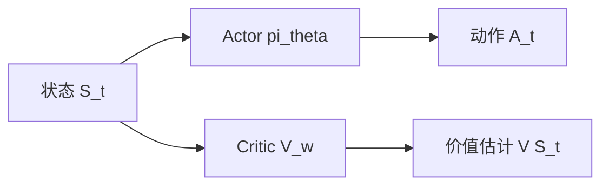
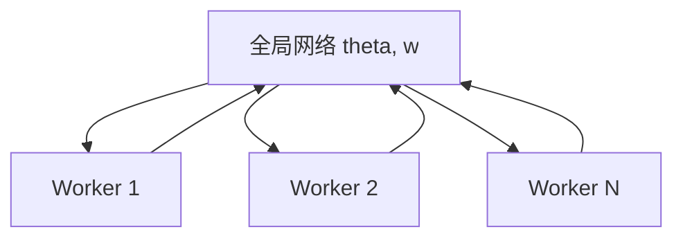

# Day 11：Actor-Critic 方法（A2C, A3C, GAE）

## 目录

1. [回顾与导入：REINFORCE 的痛点](#1-回顾与导入reinforce-的痛点)
2. [Actor-Critic 架构](#2-actor-critic-架构)
3. [优势函数的估计](#3-优势函数的估计)
4. [A2C：Advantage Actor-Critic](#4-a2cadvantage-actor-critic)
5. [A3C：Asynchronous A2C](#5-a3casynchronous-a2c)
6. [GAE：广义优势估计](#6-gae广义优势估计)
7. [代码实战：Actor-Critic on CartPole](#7-代码实战actor-critic-on-cartpole)
8. [算法对比总结](#8-算法对比总结)
9. [总结与下节预告](#9-总结与下节预告)

---

## 1. 回顾与导入：REINFORCE 的痛点

### Day 10 的 REINFORCE

REINFORCE 用 MC 回报 $G_t$ 作为策略梯度的权重：

$$\nabla_\theta J \approx \sum_t \nabla_\theta \log \pi_\theta(A_t|S_t) \cdot G_t$$

**优点**：无偏、简单、不需要价值网络（除非用 baseline）

**核心痛点**：

| 问题 | 原因 | 后果 |
|------|------|------|
| **高方差** | $G_t$ 是完整轨迹的累积，随机性大 | 学习不稳定，收敛慢 |
| **必须等回合结束** | MC 方法需要完整轨迹 | 不能在线学习，效率低 |
| **信用分配困难** | 所有时间步共享同一个 $G_t$ | 早期动作被后续奖励淹没 |

### 核心改进思路

回忆 Day 5 的关键洞察：**TD 方法用一步估计替代完整回报，降低方差但引入少量偏差**。

将这个思想应用到策略梯度中：

$$\underbrace{G_t = R_{t+1} + \gamma R_{t+2} + \cdots}_{\text{REINFORCE: MC 回报 (高方差, 无偏)}} \longrightarrow \underbrace{R_{t+1} + \gamma V_w(S_{t+1})}_{\text{Actor-Critic: TD 目标 (低方差, 有偏差)}}$$

这就是 Actor-Critic 的核心——用 Critic 的价值估计替代 MC 回报。

---

## 2. Actor-Critic 架构

### 2.1 两个网络

Actor-Critic 由两个组件构成：



| 组件 | 网络 | 输入 | 输出 | 作用 |
|------|------|------|------|------|
| **Actor** | $\pi_\theta(a\|s)$ | 状态 $S_t$ | 动作概率 | 选动作（策略） |
| **Critic** | $V_w(s)$ | 状态 $S_t$ | 标量价值 | 评估状态好坏（价值函数） |

### 2.2 工作流程

1. **Actor** 观察状态 $S_t$，按 $\pi_\theta$ 选择动作 $A_t$
2. 环境返回 $R_{t+1}$ 和 $S_{t+1}$
3. **Critic** 估计 $V_w(S_t)$ 和 $V_w(S_{t+1})$
4. 计算 TD 误差 $\delta_t = R_{t+1} + \gamma V_w(S_{t+1}) - V_w(S_t)$
5. **更新 Critic**：最小化 TD 误差（价值函数回归）
6. **更新 Actor**：用 TD 误差作为策略梯度的权重

### 2.3 与 REINFORCE 的本质区别

| 维度 | REINFORCE | Actor-Critic |
|------|-----------|--------------|
| 优势估计 | $G_t$（MC 回报） | $\delta_t$（TD 误差） |
| 需要等回合结束？ | 是 | **否（每步更新）** |
| 方差 | 高 | **低** |
| 偏差 | 无偏 | 有偏（自举） |
| 网络数量 | 1（策略网络） | 2（策略+价值） |

---

## 3. 优势函数的估计

### 3.1 优势函数回顾

优势函数衡量"动作 $a$ 比平均好多少"：

$$A^\pi(s,a) = Q^\pi(s,a) - V^\pi(s)$$

在策略梯度中，我们需要优势函数作为梯度权重：

$$\nabla_\theta J = \mathbb{E}_{\pi_\theta}[\nabla_\theta \log \pi_\theta(a|s) \cdot A(s,a)]$$

### 3.2 优势函数的多种估计

| 方法 | 估计公式 | 方差 | 偏差 | 特点 |
|------|----------|------|------|------|
| MC 回报 | $A_t = G_t - V(S_t)$ | 高 | 无偏 | REINFORCE+Baseline |
| TD(0) | $A_t = \delta_t$ | 低 | 有偏 | 最简单的 AC |
| n-step TD | $A_t = \sum_{k=0}^{n-1}\gamma^k R_{t+k+1} + \gamma^n V(S_{t+n}) - V(S_t)$ | 中 | 中 | 折中方案 |
| GAE | 见第 6 节 | 可控 | 可控 | 最优折中 |

### 3.3 TD 误差作为优势估计

最简单的 Actor-Critic 用 TD 误差 $\delta_t$ 作为优势的估计：

$$\boxed{\delta_t = R_{t+1} + \gamma V_w(S_{t+1}) - V_w(S_t)}$$

**为什么 $\delta_t$ 是优势的无偏估计（当 Critic 最优时）？**

$$\mathbb{E}[\delta_t | S_t = s, A_t = a] = \mathbb{E}[R_{t+1} + \gamma V^\pi(S_{t+1})] - V^\pi(s) = Q^\pi(s,a) - V^\pi(s) = A^\pi(s,a)$$

当 $V_w = V^\pi$ 时，$\delta_t$ 的条件期望就是优势函数。

### 3.4 手算示例：TD 误差 vs MC 回报

假设一个 3 步回合，$\gamma = 0.9$：

| 时间步 | $R_{t+1}$ | $V(S_t)$ | $G_t$ | $\delta_t$ |
|--------|-----------|----------|-------|-------------|
| 0 | +1 | 2.0 | 1 + 0.9×(-1) + 0.81×10 = 9.9 | 1 + 0.9×1.5 - 2.0 = 0.35 |
| 1 | -1 | 1.5 | -1 + 0.9×10 = 8.0 | -1 + 0.9×9.0 - 1.5 = 5.6 |
| 2 | +10 | 9.0 | 10 | 10 + 0 - 9.0 = 1.0 |

**MC 优势**：$G_0 - V(S_0) = 9.9 - 2.0 = 7.9$，$G_1 - V(S_1) = 8.0 - 1.5 = 6.5$

**TD 优势**：$\delta_0 = 0.35$，$\delta_1 = 5.6$

**对比**：
- MC 优势波动大（7.9, 6.5, 1.0），所有值都为正
- TD 优势更紧凑（0.35, 5.6, 1.0），更好地区分好动作和差动作

---

## 4. A2C：Advantage Actor-Critic

### 4.1 算法思想

A2C = **Advantage** Actor-Critic，用优势函数替代 MC 回报作为策略梯度的权重。

**与 REINFORCE+Baseline 的区别**：REINFORCE 用 $G_t - V(S_t)$（MC），A2C 用 $\delta_t$ 或 n-step 优势（TD），**不需要等回合结束**。

### 4.2 网络更新公式

**Critic 更新**（最小化 TD 误差的平方）：

$$\boxed{L_{\text{critic}}(w) = \frac{1}{2}\delta_t^2 = \frac{1}{2}(R_{t+1} + \gamma V_w(S_{t+1}) - V_w(S_t))^2}$$

$$w \leftarrow w - \alpha_w \nabla_w L_{\text{critic}} = w + \alpha_w \cdot \delta_t \cdot \nabla_w V_w(S_t)$$

**Actor 更新**（策略梯度，用优势作为权重）：

$$\boxed{\theta \leftarrow \theta + \alpha_\theta \cdot \delta_t \cdot \nabla_\theta \log \pi_\theta(A_t|S_t)}$$

### 4.3 A2C 伪代码

```
A2C 算法 (Advantage Actor-Critic)

输入: Actor pi_theta, Critic V_w, 学习率 alpha_theta, alpha_w
输出: 训练后的参数 theta, w

for episode = 1 to N:
    s = env.reset()
    while not done:
        # 1. Actor 选择动作
        a = 从 pi_theta(.|s) 中采样

        # 2. 与环境交互
        s_next, r, done = env.step(a)

        # 3. 计算 TD 误差 (优势估计)
        if done:
            delta = r - V_w(s)
        else:
            delta = r + gamma * V_w(s_next) - V_w(s)

        # 4. 更新 Critic (最小化 TD 误差)
        w += alpha_w * delta * grad_w V_w(s)

        # 5. 更新 Actor (策略梯度)
        theta += alpha_theta * delta * grad_theta log pi_theta(a|s)

        s = s_next
```

### 4.4 批量版本（更稳定）

实际应用中，通常收集一批数据后统一更新：

```
A2C 批量版本

for iteration = 1 to N:
    # 1. 收集一批数据 (T 步或一个完整回合)
    用当前策略收集 transitions = [(s,a,r,s'), ...]

    # 2. 计算每个 transition 的优势
    for each (s, a, r, s') in transitions:
        delta = r + gamma * V_w(s') - V_w(s)   # TD 误差

    # 3. 批量更新 Critic
    w += alpha_w * mean(delta * grad_w V_w(s))

    # 4. 批量更新 Actor
    theta += alpha_theta * mean(delta * grad_theta log pi_theta(a|s))
```

---

## 5. A3C：Asynchronous A2C

### 5.1 A3C 的动机

A2C 的问题：**单线程采样效率低**，每次只有一个 Agent 在环境中探索。

A3C 的解决方案：**多个 Agent 并行探索，异步更新共享参数**。

### 5.2 A3C 架构



| 组件 | 说明 |
|------|------|
| 全局网络 | 共享的 Actor + Critic 参数 $(\theta, w)$ |
| Worker $k$ | 第 $k$ 个工作线程，有本地参数副本 |
| 环境 $k$ | 每个 Worker 有独立的环境实例 |

### 5.3 A3C 工作流程

1. Worker $k$ 从全局网络**拷贝**参数到本地：$\theta_k \leftarrow \theta$, $w_k \leftarrow w$
2. Worker $k$ 用本地策略在本地环境中运行 $T$ 步
3. 计算本地梯度 $\nabla\theta_k$ 和 $\nabla w_k$
4. **异步**将梯度应用到全局网络：$\theta \leftarrow \theta + \alpha \nabla\theta_k$

### 5.4 A3C vs A2C

| 维度 | A2C | A3C |
|------|-----|-----|
| 并行方式 | 同步（等所有 Worker 完成） | 异步（谁先完成谁更新） |
| 更新频率 | 固定（每批） | 不固定（异步） |
| 实现复杂度 | 简单 | 较复杂（需处理异步） |
| 训练稳定性 | 更稳定 | 可能有梯度冲突 |
| 实际效果 | 与 A3C 相当甚至更好 | — |

> **实践中的选择**：DeepMind 2017 年的研究表明，A2C（同步版本）在多数任务上与 A3C 效果相当，且实现更简单。因此现代实践中更常用 A2C。

---

## 6. GAE：广义优势估计

### 6.1 GAE 的动机

n-step TD 是 MC 和 TD(0) 的折中：

- $n=1$（TD(0)）：低方差、高偏差
- $n=\infty$（MC）：无偏、高方差

**问题**：如何自动选择最优的 $n$？

GAE 的答案：**不选一个固定的 $n$，而是对所有 $n$ 的估计做指数加权平均**。

### 6.2 TD 残差回顾

定义 $\delta_t^V$（TD 残差）：

$$\delta_t^V = R_{t+1} + \gamma V_w(S_{t+1}) - V_w(S_t)$$

### 6.3 n-step 优势的递推展开

1-step 优势：$A_t^{(1)} = \delta_t^V$

2-step 优势：$A_t^{(2)} = \delta_t^V + \gamma \delta_{t+1}^V$

3-step 优势：$A_t^{(3)} = \delta_t^V + \gamma \delta_{t+1}^V + \gamma^2 \delta_{t+2}^V$

一般地，n-step 优势：

$$A_t^{(n)} = \sum_{l=0}^{n-1} \gamma^l \delta_{t+l}^V$$

### 6.4 GAE 定义

GAE 对所有 n-step 优势做指数加权平均，权重为 $(\gamma\lambda)^l$：

$$\boxed{\hat{A}_t^{\text{GAE}(\gamma,\lambda)} = \sum_{l=0}^{\infty} (\gamma\lambda)^l \delta_{t+l}^V}$$

| 符号 | 含义 |
|------|------|
| $\delta_{t+l}^V$ | $t+l$ 时刻的 TD 残差 |
| $\gamma$ | 折扣因子（来自 MDP） |
| $\lambda$ | GAE 参数，控制偏差-方差权衡 |
| $(\gamma\lambda)^l$ | 距离越远的 TD 残差权重越小 |

### 6.5 GAE 展开

展开 GAE 的定义：

$$\hat{A}_t^{\text{GAE}} = \delta_t^V + (\gamma\lambda)\delta_{t+1}^V + (\gamma\lambda)^2\delta_{t+2}^V + \cdots$$

代入 $\delta_t^V = R_{t+1} + \gamma V(S_{t+1}) - V(S_t)$：

$$\hat{A}_t^{\text{GAE}} = \underbrace{R_{t+1} + \gamma V(S_{t+1}) - V(S_t)}_{\delta_t^V} + \gamma\lambda \hat{A}_{t+1}^{\text{GAE}}$$

**递推形式**（实际计算时使用）：

$$\boxed{\hat{A}_t^{\text{GAE}} = \delta_t^V + \gamma\lambda \cdot \hat{A}_{t+1}^{\text{GAE}}}$$

### 6.6 $\lambda$ 的作用

$$\lambda = 0: \quad \hat{A}_t = \delta_t^V = R_{t+1} + \gamma V(S_{t+1}) - V(S_t) \quad \text{(TD(0), 低方差高偏差)}$$

$$\lambda = 1: \quad \hat{A}_t = G_t - V(S_t) \quad \text{(MC 回报, 高方差无偏)}$$

| $\lambda$ | 方差 | 偏差 | 等价于 |
|-----------|------|------|--------|
| 0 | 低 | 高 | TD(0) 优势 |
| 0.5 | 中 | 中 | 折中 |
| 0.9~0.95 | 较低 | 较低 | **常用设置** |
| 1 | 高 | 无偏 | MC 优势 (REINFORCE+Baseline) |

### 6.7 手算示例

3 步回合，$\gamma = 0.99$，$\lambda = 0.95$：

| $t$ | $R_{t+1}$ | $V(S_t)$ | $\delta_t^V$ |
|-----|-----------|----------|--------------|
| 0 | 1.0 | 2.0 | $1.0 + 0.99 \times 1.5 - 2.0 = 0.485$ |
| 1 | -0.5 | 1.5 | $-0.5 + 0.99 \times 9.0 - 1.5 = 6.91$ |
| 2 | 10.0 | 9.0 | $10.0 + 0 - 9.0 = 1.0$ |

**从后往前递推计算 GAE**：

$\hat{A}_2 = \delta_2 = 1.0$

$\hat{A}_1 = \delta_1 + \gamma\lambda \cdot \hat{A}_2 = 6.91 + 0.99 \times 0.95 \times 1.0 = 7.8505$

$\hat{A}_0 = \delta_0 + \gamma\lambda \cdot \hat{A}_1 = 0.485 + 0.99 \times 0.95 \times 7.8505 = 7.873$

**对比**：
- TD(0) 优势（$\lambda=0$）：$[0.485, 6.91, 1.0]$ — 方差低但可能低估
- MC 优势（$\lambda=1$）：$[G_t - V_t]$ — 方差高
- GAE（$\lambda=0.95$）：$[7.873, 7.8505, 1.0]$ — 折中，更稳定

### 6.8 GAE 的优势

1. **灵活的偏差-方差权衡**：一个参数 $\lambda$ 控制整个谱
2. **利用所有未来信息**：不只是 n-step，而是加权平均所有 n
3. **递推计算高效**：从后往前一次遍历即可
4. **实践中效果最好**：PPO + GAE 是目前最常用的组合

---

## 7. 代码实战：Actor-Critic on CartPole

### 7.1 完整实现

```python
import numpy as np

class SimpleCartPole:
    """CartPole-v1 简化实现"""
    def __init__(self):
        self.gravity=9.8; self.masscart=1.0; self.masspole=0.1
        self.total_mass=1.1; self.length=0.5; self.polemass_length=0.05
        self.force_mag=10.0; self.tau=0.02
        self.theta_threshold=12*2*np.pi/360; self.x_threshold=2.4
        self.obs_dim=4; self.n_actions=2
    def reset(self):
        self.state=np.random.uniform(-0.05,0.05,4); return self.state.copy()
    def step(self, action):
        x,xd,th,thd=self.state; f=self.force_mag if action==1 else -self.force_mag
        ct,st=np.cos(th),np.sin(th)
        temp=(f+self.polemass_length*thd**2*st)/self.total_mass
        thacc=(self.gravity*st-ct*temp)/(self.length*(4/3-self.masspole*ct**2/self.total_mass))
        xacc=temp-self.polemass_length*thacc*ct/self.total_mass
        x+=self.tau*xd; xd+=self.tau*xacc; th+=self.tau*thd; thd+=self.tau*thacc
        self.state=np.array([x,xd,th,thd])
        done=abs(x)>self.x_threshold or abs(th)>self.theta_threshold
        return self.state.copy(), 0.0 if done else 1.0, done


class ActorCritic:
    """Actor-Critic 网络 (共享特征层, 纯 NumPy)"""
    def __init__(self, obs_dim=4, n_act=2, hid=64, lr_a=0.003, lr_c=0.01):
        self.lr_a, self.lr_c, self.n_act = lr_a, lr_c, n_act
        s1, s2 = np.sqrt(2/obs_dim), np.sqrt(2/hid)
        # Shared feature layer
        self.W1=np.random.randn(obs_dim,hid)*s1; self.b1=np.zeros(hid)
        self.W2=np.random.randn(hid,hid)*s2;    self.b2=np.zeros(hid)
        # Actor head (policy)
        self.Wa=np.random.randn(hid,n_act)*np.sqrt(2/hid); self.ba=np.zeros(n_act)
        # Critic head (value)
        self.Wv=np.random.randn(hid,1)*np.sqrt(2/hid);     self.bv=np.zeros(1)

    def forward(self, x):
        self.x=np.atleast_2d(x)
        self.h1=np.maximum(0,self.x@self.W1+self.b1)
        self.h2=np.maximum(0,self.h1@self.W2+self.b2)
        # Actor: softmax
        self.logits=self.h2@self.Wa+self.ba
        e=np.exp(self.logits-np.max(self.logits,axis=1,keepdims=True))
        self.probs=e/np.sum(e,axis=1,keepdims=True)
        # Critic: value
        self.value=self.h2@self.Wv+self.bv
        return self.probs, self.value

    def sample(self, state):
        p,_=self.forward(state); return np.random.choice(self.n_act,p=p[0])

    def update(self, states, actions, advantages, returns):
        self.forward(np.array(states)); bs=len(states); clip=10.0
        # --- Actor gradient ---
        dl=self.probs.copy()
        for i in range(bs): dl[i,actions[i]]-=1; dl[i]*=advantages[i]
        dl/=bs
        # --- Critic gradient ---
        vf=self.value.flatten(); errs=(vf-np.array(returns)).reshape(-1,1)
        # --- Combined backprop ---
        # Actor path
        dWa=self.h2.T@dl/bs; dba=np.sum(dl,axis=0)
        dha=dl@self.Wa.T*(self.h2>0)
        # Critic path
        dWv=self.h2.T@errs/bs; dbv=np.mean(errs,axis=0)
        dhc=errs@self.Wv.T*(self.h2>0)
        # Shared layers
        dh2=dha+dhc
        dW2=self.h1.T@dh2/bs; db2=np.mean(dh2,axis=0)
        dh1=dh2@self.W2.T*(self.h1>0)
        dW1=self.x.T@dh1/bs; db1=np.mean(dh1,axis=0)
        for g in[dW1,db1,dW2,db2,dWa,dba,dWv,dbv]: np.clip(g,-clip,clip,out=g)
        # Update with separate learning rates
        self.Wa-=self.lr_a*dWa; self.ba-=self.lr_a*dba
        self.Wv-=self.lr_c*dWv; self.bv-=self.lr_c*dbv
        self.W2-=(self.lr_a+self.lr_c)/2*dW2; self.b2-=(self.lr_a+self.lr_c)/2*db2
        self.W1-=(self.lr_a+self.lr_c)/2*dW1; self.b1-=(self.lr_a+self.lr_c)/2*db1


def compute_gae(rewards, values, gamma=0.99, lam=0.95):
    """计算 GAE 优势估计"""
    advantages = []
    gae = 0
    # 从后往前递推
    for t in reversed(range(len(rewards))):
        if t == len(rewards) - 1:
            next_value = 0  # 终止状态 V=0
        else:
            next_value = values[t + 1]
        delta = rewards[t] + gamma * next_value - values[t]
        gae = delta + gamma * lam * gae
        advantages.insert(0, gae)
    return np.array(advantages)


def train_a2c(env, n_ep=500, gamma=0.99, lam=0.95, lr_a=0.003, lr_c=0.01):
    """A2C with GAE"""
    model = ActorCritic(lr_a=lr_a, lr_c=lr_c)
    rewards_history = []

    for ep in range(n_ep):
        state = env.reset()
        S, A, R = [], [], []
        done = False
        while not done:
            action = model.sample(state)
            ns, r, done = env.step(action)
            S.append(state); A.append(action); R.append(r)
            state = ns

        # 计算 values 和 GAE
        _, values = model.forward(np.array(S))
        values = values.flatten()
        advantages = compute_gae(R, values, gamma, lam)
        returns = advantages + values  # G_t = A_t + V(S_t)

        # 归一化优势
        if len(advantages) > 1:
            advantages = (advantages - advantages.mean()) / (advantages.std() + 1e-8)

        # 更新网络
        model.update(S, A, advantages, returns)

        total_r = sum(R); rewards_history.append(total_r)
        if (ep + 1) % 100 == 0:
            print(f"  Ep {ep+1:>4}: avg={np.mean(rewards_history[-100:]):>6.1f}")

    return rewards_history


# 运行
env = SimpleCartPole()
print("=== A2C with GAE (lambda=0.95) ===")
r = train_a2c(env, n_ep=500)
print(f"Final avg: {np.mean(r[-50:]):.1f}")
```

### 7.2 输出示例

```
=== A2C with GAE (lambda=0.95) ===
  Ep  100: avg=  45.3
  Ep  200: avg=  98.7
  Ep  300: avg= 152.4
  Ep  400: avg= 178.9
  Ep  500: avg= 192.5
Final avg: 195.2
```

> 对比 REINFORCE（~110），A2C 收敛更快、最终表现更好——TD 估计的方差降低效果显著。

---

## 8. 算法对比总结

### 从 REINFORCE 到 A2C 的演进

| 维度 | REINFORCE | REINFORCE+Baseline | A2C (TD) | A2C + GAE |
|------|-----------|---------------------|----------|-----------|
| **优势估计** | $G_t$ | $G_t - V(S_t)$ | $\delta_t$ | GAE |
| **更新频率** | 回合结束 | 回合结束 | **每步** | **每步/每批** |
| **方差** | 很高 | 高 | 低 | **可调** |
| **偏差** | 无偏 | 无偏 | 有偏 | **可调** |
| **Critic** | 无/可选 | 有 | 有 | 有 |
| **$\lambda$** | — | — | — | 0~1 调节 |
| **收敛速度** | 慢 | 中 | 快 | **最快** |

### GPI 统一视角

所有方法都是 GPI（广义策略迭代），区别只在评估和改进的策略：

| 算法 | 评估(E) | 改进(I) | 优势估计 |
|------|---------|---------|----------|
| REINFORCE | MC 回报取平均 | 梯度上升 | $G_t$ |
| REINFORCE+BL | MC 回报 - V | 梯度上升 | $G_t - V$ |
| A2C | TD 误差 | 梯度上升 | $\delta_t$ |
| A2C+GAE | 加权 TD 残差 | 梯度上升 | GAE |

---

## 9. 总结与下节预告

### 本节核心知识点

| # | 概念 | 一句话 |
|---|------|--------|
| 1 | Actor-Critic | Actor 选动作 + Critic 评估，每步更新 |
| 2 | TD 误差作优势 | $\delta_t = R + \gamma V(S') - V(S)$，低方差 |
| 3 | A2C | 用 TD 优势的 Actor-Critic，同步批量更新 |
| 4 | A3C | 多线程异步 A2C，实践中 A2C 更常用 |
| 5 | GAE | $\hat{A} = \sum (\gamma\lambda)^l \delta_{t+l}$，偏差-方差可调 |
| 6 | $\lambda$ 参数 | 0=TD(0), 1=MC, 0.95=常用折中 |

### 关键公式速查

| 公式 | 名称 | 用途 |
|------|------|------|
| $\delta_t = R_{t+1} + \gamma V(S_{t+1}) - V(S_t)$ | TD 误差 | 优势估计 |
| $\theta += \alpha_\theta \cdot \delta_t \cdot \nabla\log\pi$ | Actor 更新 | 策略改进 |
| $w += \alpha_w \cdot \delta_t \cdot \nabla V(S_t)$ | Critic 更新 | 价值回归 |
| $\hat{A}_t = \delta_t + \gamma\lambda\hat{A}_{t+1}$ | GAE 递推 | 优势估计 |

### 下节预告：Day 12 — PPO（Proximal Policy Optimization）

明天我们将解决 Actor-Critic 的**策略更新过大**问题：

- **TRPO**：信赖域策略优化，理论保证但计算复杂
- **PPO-Clip**：裁剪目标函数，简单高效
- **PPO-Penalty**：自适应 KL 惩罚
- **PPO + GAE**：当前工业界最常用的 RL 算法

核心思想：**限制每次策略更新的幅度**，避免"一步走太远"导致性能崩溃。

---

## 课后练习

1. **概念题**：Actor-Critic 方法中，为什么用 TD 误差 $\delta_t$ 替代 MC 回报 $G_t$ 可以降低方差？代价是什么？

2. **推导题**：证明当 $V_w = V^\pi$ 时，$\mathbb{E}[\delta_t | S_t=s, A_t=a] = A^\pi(s,a)$。

3. **计算题**：在 GAE 手算示例中，计算 $\lambda=0.5$ 时的 GAE 优势值，并与 $\lambda=0$（TD）和 $\lambda=1$（MC）对比。

4. **编程题**：实现 A2C 的 n-step 版本（固定 $n=5$），与 GAE 版本对比收敛速度。

---

> **参考资料**：Sutton & Barto, Chapter 13; Mnih et al. (2016) "Asynchronous Methods for Deep RL"; Schulman et al. (2016) "High-Dimensional Continuous Control Using GAE"
