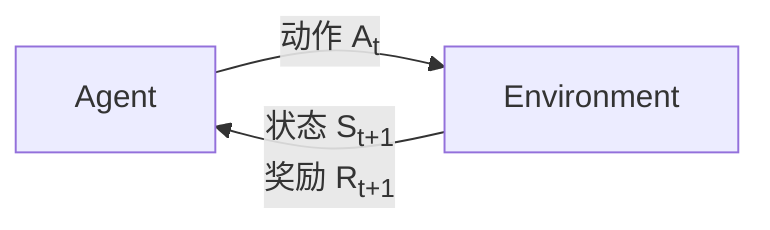
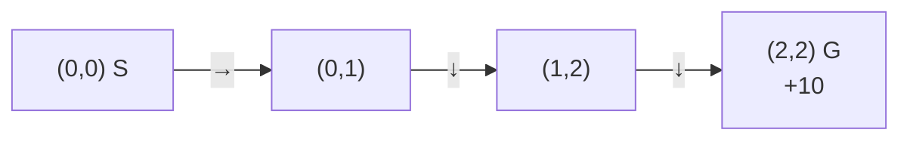

# Day 1：强化学习引言与马尔可夫决策过程（MDP）

## 目录

1. [什么是强化学习](#1-什么是强化学习)
2. [核心组件与交互过程](#2-核心组件与交互过程)
3. [马尔可夫决策过程（MDP）](#3-马尔可夫决策过程mdp)
4. [回报与价值函数](#4-回报与价值函数)
5. [策略（Policy）](#5-策略policy)
6. [实例：网格世界（Grid World）](#6-实例网格世界grid-world)
7. [总结与下节预告](#7-总结与下节预告)

---

## 1. 什么是强化学习

**强化学习（Reinforcement Learning, RL）** 是机器学习的一个重要分支，研究**智能体（Agent）** 如何在与**环境（Environment）** 的交互中，通过**试错（Trial and Error）** 来学习最优行为策略，以最大化**累积奖励（Cumulative Reward）**。

### 与其他机器学习范式的对比

| 范式 | 数据特点 | 反馈形式 | 目标 |
|------|----------|----------|------|
| 监督学习 | 带标签的数据集 | 正确答案 | 学习输入到输出的映射 |
| 无监督学习 | 无标签数据 | 无显式反馈 | 发现数据中的隐藏结构 |
| **强化学习** | 交互产生的序列 | 奖励信号 | 最大化长期累积奖励 |

### 关键特征

- **没有标准答案**：Agent 不知道"正确"动作是什么，只知道动作的好坏程度（奖励）
- **延迟反馈**：奖励可能在动作执行很久之后才出现
- **序列决策**：当前决策影响未来的状态和可获得的奖励

---

## 2. 核心组件与交互过程

### 基本要素

| 要素 | 符号 | 说明 |
|------|------|------|
| **智能体（Agent）** | — | 学习者和决策者 |
| **环境（Environment）** | — | Agent 交互的外部世界 |
| **状态（State）** | $S_t \in \mathcal{S}$ | $t$ 时刻对环境快照的描述 |
| **动作（Action）** | $A_t \in \mathcal{A}$ | Agent 在 $t$ 时刻的选择 |
| **奖励（Reward）** | $R_{t+1} \in \mathbb{R}$ | 执行动作后环境反馈的标量信号 |

> **注意**：约定 $R_{t+1}$ 的下标是 $t+1$，表示在 $t$ 时刻执行动作后，$t+1$ 时刻收到的奖励。

### 交互循环



### 交互过程详解

在每一个离散时间步 $t = 0, 1, 2, \ldots$：

1. Agent 观察当前环境状态 $S_t$
2. Agent 根据**策略**选择并执行动作 $A_t$
3. 环境接收动作，状态转移至 $S_{t+1}$
4. 环境返回即时奖励 $R_{t+1}$
5. Agent 根据新的状态和奖励更新策略
6. $t \leftarrow t+1$，回到步骤 1

整个交互过程产生一条**轨迹（Trajectory）**：

$$
S_0, A_0, R_1, S_1, A_1, R_2, S_2, A_2, R_3, \ldots
$$

---

## 3. 马尔可夫决策过程（MDP）

### 3.1 什么是 MDP？

**马尔可夫决策过程（Markov Decision Process, MDP）** 是 RL 问题的标准数学框架。几乎所有 RL 问题都可以形式化为 MDP。

### 3.2 马尔可夫性质

> 状态 $S_t$ 具有**马尔可夫性质**，当且仅当：
>
> $$P(S_{t+1} \mid S_t, A_t, S_{t-1}, A_{t-1}, \ldots, S_0, A_0) = P(S_{t+1} \mid S_t, A_t)$$

**直观理解**：未来只取决于现在，与过去无关。当前状态包含了所有用于决策的历史信息。

### 3.3 MDP 的数学定义

一个 MDP 由一个五元组 $(\mathcal{S}, \mathcal{A}, P, R, \gamma)$ 定义：

| 符号 | 名称 | 含义 |
|------|------|------|
| $\mathcal{S}$ | 状态空间 | 所有可能状态的集合 |
| $\mathcal{A}$ | 动作空间 | 所有可能动作的集合（可依赖状态：$\mathcal{A}(s)$） |
| $P$ | 状态转移概率 | $P(s' \mid s, a) = P(S_{t+1}=s' \mid S_t=s, A_t=a)$ |
| $R$ | 奖励函数 | $R(s, a) = \mathbb{E}[R_{t+1} \mid S_t=s, A_t=a]$ |
| $\gamma$ | 折扣因子 | $\gamma \in [0, 1]$，权衡即时奖励与远期奖励 |

### 3.4 转移概率详解

**状态转移概率** $P(s' \mid s, a)$ 表示：在状态 $s$ 执行动作 $a$ 后，转移到状态 $s'$ 的概率。

**性质**：
- $P(s' \mid s, a) \geq 0$（非负性）
- $\sum_{s' \in \mathcal{S}} P(s' \mid s, a) = 1$（归一化）

**状态转移图（MDP 视角）**：

```mermaid
graph LR
    A[当前状态<br/>S<sub>t</sub>=s] -->|选择动作 a| B[状态转移<br/>P(s'丨s,a)]
    B -->|到达| C[下一状态<br/>S<sub>t+1</sub>=s']
    B -->|获得| D[奖励 R(s,a)]
```

> 注：图中 `丨` 替代竖线 `|` 以避免 Mermaid 解析问题。

### 3.5 奖励函数

奖励 $R_t$ 是 Agent 追求最大化的目标。奖励函数有两种等价定义：

- **状态-动作奖励**：$R(s, a) = \mathbb{E}[R_{t+1} \mid S_t = s, A_t = a]$
- **状态-动作-下一状态奖励**：$R(s, a, s') = \mathbb{E}[R_{t+1} \mid S_t = s, A_t = a, S_{t+1} = s']$

### 3.6 折扣因子 $\gamma$

**折扣因子** $\gamma \in [0, 1]$ 控制 Agent 对远期奖励的重视程度：

- $\gamma = 0$：Agent **只关心即时奖励**（短视）
- $\gamma \to 1$：Agent **同样关心远期奖励**（远见）

使用折扣因子的原因：
1. **数学便利**：确保无限时域下的回报有界（当 $\gamma < 1$ 且奖励有界时）
2. **不确定性**：未来越远，不确定性越大
3. **实际偏好**：人类和动物通常偏好即时奖励

---

## 4. 回报与价值函数

### 4.1 回报（Return）

在时间步 $t$ 的**回报** $G_t$ 定义为从 $t$ 时刻开始的**折扣累积奖励**：

$$
\boxed{G_t = R_{t+1} + \gamma R_{t+2} + \gamma^2 R_{t+3} + \cdots = \sum_{k=0}^{\infty} \gamma^k R_{t+k+1}}
$$

**递推关系**（将在 Day 2 贝尔曼方程中重点使用）：

$$
\begin{aligned}
G_t &= R_{t+1} + \gamma R_{t+2} + \gamma^2 R_{t+3} + \cdots \\
    &= R_{t+1} + \gamma(R_{t+2} + \gamma R_{t+3} + \cdots) \\
    &= R_{t+1} + \gamma G_{t+1}
\end{aligned}
$$

### 4.2 状态价值函数（State Value Function）

状态价值函数 **$V^\pi(s)$** 衡量在状态 $s$ 下，按照策略 $\pi$ 行动所获得的**期望回报**：

$$
\boxed{V^\pi(s) = \mathbb{E}_\pi[G_t \mid S_t = s] = \mathbb{E}_\pi\left[\sum_{k=0}^{\infty} \gamma^k R_{t+k+1} \;\Big|\; S_t = s\right]}
$$

**含义**：从状态 $s$ 出发，一直按策略 $\pi$ 选择动作，长期来看能获得多少累积奖励。

### 4.3 动作价值函数（Action Value Function / Q-Function）

动作价值函数 **$Q^\pi(s, a)$** 衡量在状态 $s$ 下**先执行动作 $a$**，之后按照策略 $\pi$ 行动所获得的期望回报：

$$
\boxed{Q^\pi(s, a) = \mathbb{E}_\pi[G_t \mid S_t = s, A_t = a] = \mathbb{E}_\pi\left[\sum_{k=0}^{\infty} \gamma^k R_{t+k+1} \;\Big|\; S_t = s, A_t = a\right]}
$$

**$V$ 与 $Q$ 的关系**：

$$
V^\pi(s) = \sum_{a \in \mathcal{A}} \pi(a \mid s) Q^\pi(s, a)
$$

$V$ 是 $Q$ 在策略 $\pi$ 下的**加权平均**。

---

## 5. 策略（Policy）

### 5.1 策略的定义

**策略** $\pi$ 是 Agent 的决策规则，定义了在每个状态下如何选择动作：

- **随机策略**：$\pi(a \mid s) = P(A_t = a \mid S_t = s)$，在状态 $s$ 选择动作 $a$ 的概率分布
- **确定性策略**：$a = \pi(s)$，在状态 $s$ 直接指定要执行的动作

> 满足概率性质：$\pi(a \mid s) \geq 0$ 且 $\sum_{a} \pi(a \mid s) = 1$

### 5.2 最优策略

RL 的最终目标是找到**最优策略** $\pi^*$，使得对所有状态 $s$，期望回报最大化：

$$
\boxed{V^*(s) = \max_\pi V^\pi(s)} \qquad \boxed{Q^*(s, a) = \max_\pi Q^\pi(s, a)}
$$

**最优策略存在的保证**：对于任何有限 MDP，至少存在一个确定性最优策略。

---

## 6. 实例：网格世界（Grid World）

### 场景描述

一个 $3 \times 3$ 的网格世界，Agent 从**起点（S）**出发，目标是到达**终点（G）**并避开**陷阱（T）**。

```
┌─────┬─────┬─────┐
│  S  │     │  T  │
├─────┼─────┼─────┤
│     │  #  │     │
├─────┼─────┼─────┤
│     │     │  G  │
└─────┴─────┴─────┘

S = 起点 (0,0)    G = 终点 (2,2), 奖励 +10
T = 陷阱 (0,2), 奖励 -10    # = 障碍 (1,1), 不可穿越
```

### MDP 形式化

| 要素 | 取值 |
|------|------|
| $\mathcal{S}$ | 8 个可通行格子，坐标 $(i, j)$ |
| $\mathcal{A}$ | {↑, ↓, ←, →} |
| 转移概率 | 确定性转移（概率 $p=0.8$ 往目标方向，$p=0.2$ 随机偏向一侧） |
| $R(s, a)$ | 到达 G：$+10$；到达 T：$-10$；其他：$-1$（每步代价） |
| $\gamma$ | $0.9$ |

### 学习目标

Agent 需要学会：**绕开陷阱和障碍，用最短路径到达终点**。

最优策略对应的路径：



> 最优路径长 3 步（S → 右 → 下 → 下），总回报 = $-1 + (-1) + 10 = 8$（无折扣）

### 代码演示（概念性）

```python
# 伪代码：Grid World 环境的核心逻辑（实际实现将在后续课程中完成）
class GridWorld:
    def __init__(self):
        self.grid = [[0, 0, -10], [0, None, 0], [0, 0, 10]]  # reward map
        self.state = (0, 0)  # start position

    def step(self, action):
        """执行动作，返回 (next_state, reward, done)"""
        i, j = self.state
        di, dj = [(-1,0), (1,0), (0,-1), (0,1)][action]  # ↑↓←→
        ni, nj = i + di, j + dj
        if 0 <= ni < 3 and 0 <= nj < 3 and self.grid[ni][nj] is not None:
            self.state = (ni, nj)
        reward = self.grid[self.state[0]][self.state[1]]
        done = reward != 0  # terminal if at G or T
        return self.state, reward, done
```

---

## 7. 总结与下节预告

### 本节核心知识点

| 概念 | 关键公式或定义 |
|------|---------------|
| 马尔可夫性质 | $P(S_{t+1} \mid S_t, A_t, \ldots, S_0) = P(S_{t+1} \mid S_t, A_t)$ |
| MDP 五元组 | $(\mathcal{S}, \mathcal{A}, P, R, \gamma)$ |
| 回报 | $G_t = \sum_{k=0}^{\infty} \gamma^k R_{t+k+1}$ |
| 状态价值函数 | $V^\pi(s) = \mathbb{E}_\pi[G_t \mid S_t = s]$ |
| 动作价值函数 | $Q^\pi(s, a) = \mathbb{E}_\pi[G_t \mid S_t = s, A_t = a]$ |
| 策略 | $\pi(a \mid s) = P(A_t = a \mid S_t = s)$ |
| RL 目标 | 找到 $\pi^*$ 使 $V^\pi(s)$ 最大化 |

### 下节预告：Day 2 — 贝尔曼方程

在 Day 2 中，我们将学习：
- **贝尔曼期望方程**：$V^\pi$ 和 $Q^\pi$ 的递推关系
- **贝尔曼最优方程**：$V^*$ 和 $Q^*$ 的性质
- 如何用贝尔曼方程连接"当前价值"与"未来价值"

**核心直觉**：价值函数的定义中包含无限求和，但通过贝尔曼方程，我们可以把它写成**当前奖励 + 未来价值的期望**，从而可以迭代求解。

---

## 课后练习

1. **概念题**：解释为什么说"当前状态包含了所有历史信息"是 MDP 的核心假设。如果这个假设不成立，会带来什么问题？

2. **计算题**：在 Grid World 例子中，假设 $\gamma = 0.9$，Agent 按照路径 S → (0,1) → (1,2) → G 行动（每步奖励 -1，到达 G 奖励 +10）。计算：
   - 从 S 出发的回报 $G_0$
   - 从 (0,1) 出发的回报 $G_1$

3. **思考题**：如果 Grid World 中每个动作只有 80% 概率按预期执行（20% 概率随机偏向一侧），这对 Agent 的最优策略会有什么影响？

---

> **参考资料**：Sutton & Barto, Chapter 3: Finite Markov Decision Processes
