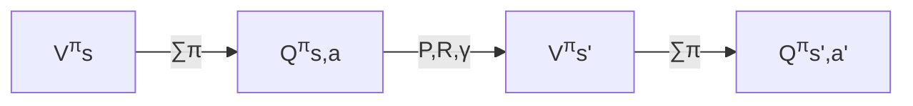
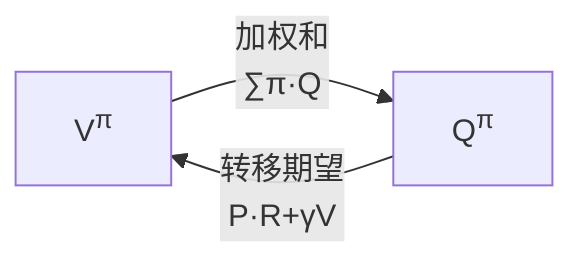
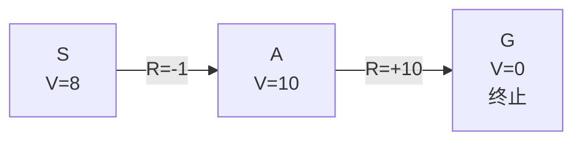

# Day 2：贝尔曼方程（Bellman Equation）

## 目录

1. [回顾与导入](#1-回顾与导入)
2. [回报的递推——贝尔曼方程的核心思想](#2-回报的递推贝尔曼方程的核心思想)
3. [贝尔曼期望方程（Bellman Expectation Equation）](#3-贝尔曼期望方程bellman-expectation-equation)
4. [最优价值函数与贝尔曼最优方程](#4-最优价值函数与贝尔曼最优方程)
5. [V 与 Q 的关系全景图](#5-v-与-q-的关系全景图)
6. [实例：Grid World 价值计算](#6-实例grid-world-价值计算)
7. [总结与下节预告](#7-总结与下节预告)

---

## 1. 回顾与导入

### Day 1 核心回顾

昨天我们定义了三个核心量：

| 量 | 公式 | 本质 |
|----|------|------|
| 回报 $G_t$ | $\sum_{k=0}^{\infty} \gamma^k R_{t+k+1}$ | 从 $t$ 开始的累计折扣奖励 |
| 状态价值 $V^\pi(s)$ | $\mathbb{E}_\pi[G_t \mid S_t = s]$ | 状态 $s$ "值多少钱" |
| 动作价值 $Q^\pi(s, a)$ | $\mathbb{E}_\pi[G_t \mid S_t = s, A_t = a]$ | 在 $s$ 做 $a$ "值多少钱" |

### 一个关键问题

这三个量的定义都包含**无限求和**。计算机没办法算无限项。怎么办？

> 答案：利用 **$G_t = R_{t+1} + \gamma G_{t+1}$** 这个递推关系，把无限和变成一步递推。

这就是贝尔曼方程的本质。

---

## 2. 回报的递推——贝尔曼方程的核心思想

### 从无限求和到一步递推

$$
\begin{aligned}
G_t &= R_{t+1} + \gamma R_{t+2} + \gamma^2 R_{t+3} + \gamma^3 R_{t+4} + \cdots \\
    &= R_{t+1} + \gamma \cdot \underbrace{(R_{t+2} + \gamma R_{t+3} + \gamma^2 R_{t+4} + \cdots)}_{G_{t+1}} \\[4pt]
    &= \boxed{R_{t+1} + \gamma G_{t+1}}
\end{aligned}
$$

**直观理解**：今天的总资产 = 今天的收入 + 折现后的"明天的总资产"。

这个递推关系就是一切贝尔曼方程的**源头**。

---

## 3. 贝尔曼期望方程（Bellman Expectation Equation）

贝尔曼期望方程描述的是：**给定策略 $\pi$** 下，$V^\pi$ 和 $Q^\pi$ 的递推关系。

### 3.1 $V^\pi$ 的贝尔曼方程

将 $G_t = R_{t+1} + \gamma G_{t+1}$ 代入 $V^\pi$ 的定义：

$$
\begin{aligned}
V^\pi(s) &= \mathbb{E}_\pi[G_t \mid S_t = s] \\
         &= \mathbb{E}_\pi[R_{t+1} + \gamma G_{t+1} \mid S_t = s]
\end{aligned}
$$

拆分为两步：
1. **当前步**：在状态 $s$ 按照策略 $\pi$ 选择动作 $a$
2. **未来步**：环境返回 $s'$ 和 $r$，然后按策略 $\pi$ 继续

将期望展开为对动作和下一状态的求和：

$$
\boxed{V^\pi(s) = \sum_{a \in \mathcal{A}} \pi(a \mid s) \sum_{s' \in \mathcal{S}} P(s' \mid s, a) \Big[ R(s, a, s') + \gamma V^\pi(s') \Big]}
$$

或者写成等价的两步形式：

$$
\boxed{V^\pi(s) = \sum_{a \in \mathcal{A}} \pi(a \mid s) \; Q^\pi(s, a)}
$$

### 3.2 $Q^\pi$ 的贝尔曼方程

同样地，将 $G_t = R_{t+1} + \gamma G_{t+1}$ 代入 $Q^\pi$ 的定义：

$$
\begin{aligned}
Q^\pi(s, a) &= \mathbb{E}_\pi[G_t \mid S_t = s, A_t = a] \\
            &= \mathbb{E}_\pi[R_{t+1} + \gamma G_{t+1} \mid S_t = s, A_t = a]
\end{aligned}
$$

动作 $a$ 已经执行完毕，下一步环境返回 $s'$ 和 $r$，然后按策略 $\pi$ 继续选择 $a'$：

$$
\boxed{Q^\pi(s, a) = \sum_{s' \in \mathcal{S}} P(s' \mid s, a) \Big[ R(s, a, s') + \gamma \sum_{a' \in \mathcal{A}} \pi(a' \mid s') Q^\pi(s', a') \Big]}
$$

或者写成：

$$
\boxed{Q^\pi(s, a) = \sum_{s' \in \mathcal{S}} P(s' \mid s, a) \Big[ R(s, a, s') + \gamma V^\pi(s') \Big]}
$$

### 3.3 图示：贝尔曼期望方程的递推结构



### 3.4 数值示例

以 Grid World 为例。假设 $\gamma=0.9$，状态 (1,2) 的价值已知为 $V^\pi(1,2)=5$。

计算在 (1,2) 选择动作 ↓ 的 Q 值（80% 概率到达 G，20% 偏离到别处）：

$$
\begin{aligned}
Q^\pi((1,2), \downarrow) &= 0.8 \times [R + \gamma V(\text{G})] + 0.1 \times [R + \gamma V(\text{左})] + 0.1 \times [R + \gamma V(\text{右})] \\
&\approx 0.8 \times [-1 + 0.9 \times 10] + 0.2 \times [-1 + 0.9 \times 5] \\
&= 0.8 \times 8 + 0.2 \times 3.5 \\
&= 6.4 + 0.7 = 7.1
\end{aligned}
$$

> 注意：这里 $V(\text{G}) = 0$（终止状态），但为了演示使用了简化数据。

---

## 4. 最优价值函数与贝尔曼最优方程

### 4.1 最优价值函数

最优策略 $\pi^*$ 对应的价值函数称为**最优价值函数**：

$$
V^*(s) = \max_\pi V^\pi(s), \quad \forall s \in \mathcal{S}
$$

$$
Q^*(s, a) = \max_\pi Q^\pi(s, a), \quad \forall s \in \mathcal{S}, a \in \mathcal{A}
$$

### 4.2 贝尔曼最优方程（Bellman Optimality Equation）

贝尔曼最优方程描述的是 $\pi^*$ 下的递推关系。与期望方程关键区别：**把 ∑π 换成了 max**。

**$V^*$ 的贝尔曼最优方程**：

$$
\boxed{V^*(s) = \max_{a \in \mathcal{A}} \sum_{s' \in \mathcal{S}} P(s' \mid s, a) \Big[ R(s, a, s') + \gamma V^*(s') \Big]}
$$

**$Q^*$ 的贝尔曼最优方程**：

$$
\boxed{Q^*(s, a) = \sum_{s' \in \mathcal{S}} P(s' \mid s, a) \Big[ R(s, a, s') + \gamma \max_{a' \in \mathcal{A}} Q^*(s', a') \Big]}
$$

### 4.3 从 $Q^*$ 到 $\pi^*$

一旦知道了 $Q^*(s, a)$，最优策略可以直接提取：

$$
\boxed{\pi^*(s) = \arg\max_{a \in \mathcal{A}} Q^*(s, a)}
$$

**大白话**：在每个状态，选 Q 值最大的那个动作。

这就是为什么 Q-Learning 这类算法直接学 $Q^*$ 就够了——有了 $Q^*$，最优策略就自动有了。

### 4.4 期望方程 vs 最优方程对比

| | 贝尔曼期望方程 | 贝尔曼最优方程 |
|----|--------------|----------------|
| 前提 | 给定策略 $\pi$ | 最优策略 $\pi^*$ |
| 运算 | 对 $\pi$ 加权平均 $\sum \pi(a \mid s)$ | 取最大值 $\max_a$ |
| 用途 | **评估**一个策略好坏 | **寻找**最优策略 |
| 对应算法 | 策略评估（Policy Evaluation） | 价值迭代（Value Iteration） |

---

## 5. V 与 Q 的关系全景图

将 $V^\pi$ 和 $Q^\pi$ 的关系总结为四个核心等式：

### 等式 ①：V → Q（按策略选择动作）

$$
V^\pi(s) = \sum_{a} \pi(a \mid s) Q^\pi(s, a)
$$

### 等式 ②：Q → V（环境转移 + 折扣）

$$
Q^\pi(s, a) = \sum_{s'} P(s' \mid s, a) \Big[ R(s, a, s') + \gamma V^\pi(s') \Big]
$$

### 等式 ③：组合（V 的贝尔曼期望方程）

将 ① 和 ② 合并：

$$
V^\pi(s) = \sum_{a} \pi(a \mid s) \sum_{s'} P(s' \mid s, a) \Big[ R(s, a, s') + \gamma V^\pi(s') \Big]
$$

### 等式 ④：最优组合（V 的贝尔曼最优方程）

将 $\sum_a \pi(a \mid s)$ 替换为 $\max_a$：

$$
V^*(s) = \max_{a} \sum_{s'} P(s' \mid s, a) \Big[ R(s, a, s') + \gamma V^*(s') \Big]
$$

### 关系图



---

## 6. 实例：Grid World 价值计算

### 场景

回到昨天的 Grid World，这次我们**手动计算**价值函数来理解贝尔曼方程。

```
┌─────┬─────┬─────┐
│  S  │     │  T  │
├─────┼─────┼─────┤
│     │  #  │  B  │
├─────┼─────┼─────┤
│     │     │  G  │
└─────┴─────┴─────┘

S = (0,0)  起点      T = (0,2)  陷阱, R = -10
G = (2,2)  终点, R = +10    # = (1,1)  障碍
B = (1,2)  关键位置（临近终点）
```

### 设定

- $\gamma = 0.9$
- 每一步的即时奖励：到达 G 得 +10，到 T 得 -10，其他每步 -1
- 简化为**确定性转移**（动作 100% 成功）
- 终止状态：G 和 T，到达后回合结束（$V(G)=0$，$V(T)=0$，但终结奖励在到达那一步发放）

### 手动计算最优价值

**第一步**：计算 (1,2) 位置的价值。

从 (1,2) 出发：
- 向上 → (0,2) T：奖励 -10，$V(T)=0$
- 向下 → (2,2) G：奖励 +10，$V(G)=0$

$$
\begin{aligned}
Q^*((1,2), \uparrow) &= R + \gamma V(T) = -10 + 0.9 \times 0 = -10 \\
Q^*((1,2), \downarrow) &= R + \gamma V(G) = +10 + 0.9 \times 0 = +10
\end{aligned}
$$

最优策略选 ↓，因此：

$$V^*((1,2)) = \max(-10, +10) = 10$$

**第二步**：计算 (0,1) 位置的价值。

从 (0,1) 出发：
- 向右 → (0,2) T：-10
- 向下 → (1,1) #：不可通行，留在原地
- 向左 → (0,0) S：$R = -1$，想算后续需要 $V(S)$（递归了）

因此最优路径应该是 (0,1) → (1,1) 不通，尝试走 (0,1) → (1,1) 不通...等等这不对。

实际上 (0,1) 的最优选择是↓到 (1,1) 被阻挡，或→到 (0,2) T...都不好。

实际上应该 (0,0)→(0,1)→(1,2)→(2,2)，走右下角的路线：

- (0,1) ↓ → (1,1) 被阻挡，留在 (0,1)
- (0,1) ↓ → 被挡不行
- (0,1) → → 到 T

等等，让我重新看看地图：
```
(0,0) S    (0,1)      (0,2) T
(1,0)      (1,1) #    (1,2)
(2,0)      (2,1)      (2,2) G
```

从 S (0,0) 出发：
- 右→ (0,1)：可行
- 下↓ (1,0)：可行

初始路径 S→(0,1)→(1,1)→... 被阻挡！

所以只有两条路：
1. S → 右 → (0,1) → 下 → (1,1) 被挡 → 只能右 → (0,2) T 或者...
   实际上 (0,1) ↓ 会试图去 (1,1)，但被阻挡，所以留在 (0,1)

2. S → 下 → (1,0) → 下 → (2,0) → 右 → (2,1) → 右 → (2,2) G

路径 2 可行但绕远路。最优路径应该是 S → 右 → (0,1) → 下（被挡）→ 需要绕...

实际地图上看：
- (1,1) 是障碍物
- 从 (0,1) 往下的格子是 (1,1)，被阻挡

所以从 S 到 G 的唯一路径是：
S (0,0) → ↓ (1,0) → 需绕过 → (1,0) → (2,0) → (2,1) → (2,2) G

但这太绕了。让我重新思考...

也许 (0,1) → → (0,2) 是 T，不行。所以 (0,1) 被困住了。唯一的路是从 S 往下走。

好，让我简化一下示例，直接展示贝尔曼方程的计算思想，不纠结具体地图细节。

**简化示例**：假设一个 1 行 3 列的网格。

```
[ S ]──[ A ]──[ G ]
  V=?    V=?    V=0 (终止)

每步奖励 R=-1，到 G 奖励 +10，γ=0.9
转移是确定性的（动作 100% 成功）
```

**从最右边开始逆推**：

**状态 A (位置 1)**：
- 动作 →：到 G，$Q(A, →) = R + \gamma V(G) = (+10) + 0.9 \times 0 = 10$
- 动作 ←：到 S，$Q(A, ←) = R + \gamma V(S) = -1 + 0.9 V(S)$

$V(A) = \max(10, -1 + 0.9 V(S))$

**状态 S (位置 0)**：
- 动作 →：到 A，$Q(S, →) = R + \gamma V(A) = -1 + 0.9 V(A)$

$V(S) = -1 + 0.9 V(A)$（因为 ← 撞墙留在 S）

**联立求解**：

$$
\begin{cases}
V(A) = \max(10, -1 + 0.9 V(S)) \\
V(S) = -1 + 0.9 V(A)
\end{cases}
$$

代 $V(S)$ 入第一个方程中 max 的第二项：

$$-1 + 0.9V(S) = -1 + 0.9(-1 + 0.9V(A)) = -1.9 + 0.81V(A)$$

由于 $V(A) \geq 10$（取 max 至少 10），而 $-1.9 + 0.81 \times 10 = 6.2 < 10$，所以 max 取第一项：

$$V(A) = 10$$

代回求 $V(S)$：

$$V(S) = -1 + 0.9 \times 10 = 8$$

### 计算结果

| 状态 | $V^*(s)$ | 最优动作 |
|------|----------|----------|
| G (终止) | $0$ | — |
| A (位置 1) | $10$ | → (去 G) |
| S (位置 0) | $8$ | → (去 A) |

### 计算过程图示



> **关键洞察**：我们从终点**反向递推**，状态 A 的价值由一步后的状态 G 决定，状态 S 的价值由状态 A 决定。这就是贝尔曼方程的**自举（Bootstrapping）** 特性——用后续状态的价值来估计当前状态的价值。

### 代码实现：手工价值迭代

```python
import numpy as np

# 1行3列的网格世界: [S, A, G] = [0, 1, 2]
gamma = 0.9
R = -1          # 每步代价
R_goal = 10     # 到达终点的奖励

# 初始化价值函数为0
V = np.zeros(3)

# 贝尔曼最优方程的迭代求解（价值迭代的雏形，Day 3 正式学）
for iteration in range(100):
    V_old = V.copy()
    # 状态0 (S): 只能往右
    Q0 = R + gamma * V_old[1]  # 到达状态1
    V[0] = Q0
    # 状态1 (A): 可以往左或往右
    Q1_left  = R + gamma * V_old[0]    # 往左 → 状态0
    Q1_right = R_goal + gamma * V_old[2]  # 往右 → 终点
    V[1] = max(Q1_left, Q1_right)
    # 状态2 (G): 终止状态, V=0
    V[2] = 0
    if np.max(np.abs(V - V_old)) < 1e-6:
        print(f"收敛于第 {iteration+1} 次迭代")
        break

print("最优价值函数 V*(s):")
print(f"  V*(S) = {V[0]:.2f}")
print(f"  V*(A) = {V[1]:.2f}")
print(f"  V*(G) = {V[2]:.2f}")
print(f"\n最优策略: S → A → G")
```

```
输出:
收敛于第 2 次迭代
最优价值函数 V*(s):
  V*(S) = 8.00
  V*(A) = 10.00
  V*(G) = 0.00
最优策略: S → A → G
```

---

## 7. 总结与下节预告

### 本节核心知识点

| # | 概念 | 公式 |
|---|------|------|
| 1 | 回报递推 | $G_t = R_{t+1} + \gamma G_{t+1}$ |
| 2 | $V^\pi$ 贝尔曼期望方程 | $V^\pi(s) = \sum_a \pi(a \mid s) \sum_{s'} P(s' \mid s,a)[R + \gamma V^\pi(s')]$ |
| 3 | $Q^\pi$ 贝尔曼期望方程 | $Q^\pi(s,a) = \sum_{s'} P(s' \mid s,a)[R + \gamma \sum_{a'} \pi(a' \mid s') Q^\pi(s',a')]$ |
| 4 | $V^*$ 贝尔曼最优方程 | $V^*(s) = \max_a \sum_{s'} P(s' \mid s,a)[R + \gamma V^*(s')]$ |
| 5 | $Q^*$ 贝尔曼最优方程 | $Q^*(s,a) = \sum_{s'} P(s' \mid s,a)[R + \gamma \max_{a'} Q^*(s',a')]$ |
| 6 | 最优策略提取 | $\pi^*(s) = \arg\max_a Q^*(s,a)$ |

### 核心直觉

> **贝尔曼方程把"无限求和"变成了"一步递推"**。
>
> 当前价值 = 即时奖励 + 折现后的未来价值

这就是 RL 中 **Bootstrapping（自举）** 的含义——用自己对后续状态的估计来更新对当前状态的估计。

### 期望方程 vs 最优方程

| | 期望方程 | 最优方程 |
|----|---------|---------|
| 算子 | $\mathbb{E}_\pi$（加权平均）| $\max$（取最大值） |
| 问题 | "按 π 行动，价值是多少？" | "最优行动，价值是多少？" |
| 策略 | 已知且固定 | 未知，需要找最优 |

### 下节预告：Day 3 — 动态规划（Dynamic Programming）

明天我们将把贝尔曼方程变成**可执行的算法**：

- **策略评估（Policy Evaluation）**：已知策略，算 V
- **策略迭代（Policy Iteration）**：评估-改进交替，直到最优
- **价值迭代（Value Iteration）**：直接用贝尔曼最优方程迭代

今天写的那个 Python 代码就是价值迭代的雏形！

---

## 课后练习

1. **概念题**：贝尔曼期望方程和贝尔曼最优方程的本质区别是什么？为什么期望方程用 $\sum \pi(a|s)$ 而最优方程用 $\max_a$？

2. **推导题**：从 $V^\pi$ 的定义出发，一步步推导出 $V^\pi$ 的贝尔曼期望方程。提示：需要用到 $G_t = R_{t+1} + \gamma G_{t+1}$ 和对 $a, s'$ 的期望展开。

3. **计算题**：在 1×3 网格的示例中，如果 $\gamma = 0.5$（Agent 更短视），重新计算 $V^*(S)$ 和 $V^*(A)$。

4. **编程题**：修改示例代码，在 Grid World 中添加一个惩罚为 -5 的"泥潭"格子，观察最优策略是否改变。

---

> **参考资料**：Sutton & Barto, Chapter 3.5-3.7 (Bellman Equations)
