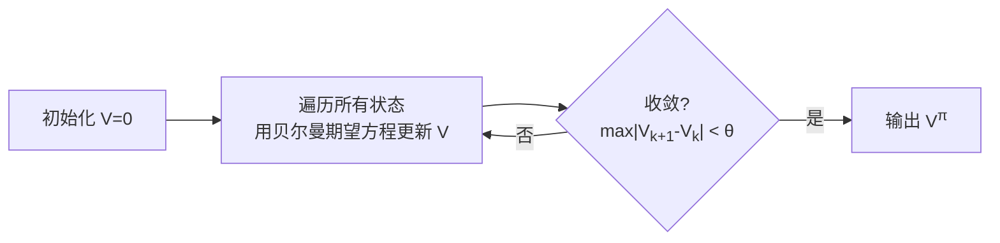
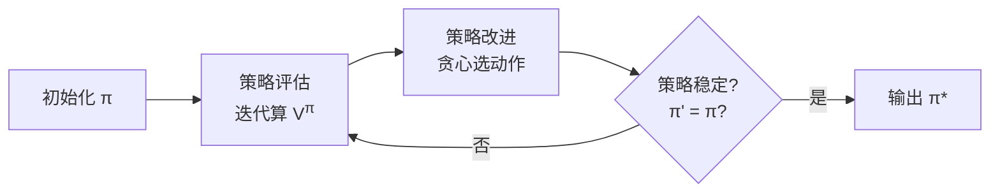
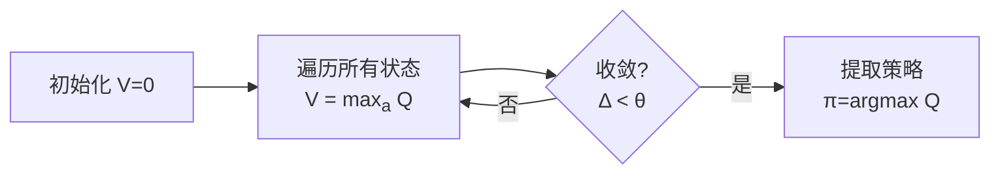
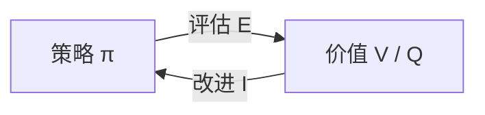

# Day 3：动态规划（Dynamic Programming）

## 目录

1. [回顾与导入](#1-回顾与导入)
2. [动态规划的核心思想](#2-动态规划的核心思想)
3. [策略评估（Policy Evaluation）](#3-策略评估policy-evaluation)
4. [策略改进（Policy Improvement）](#4-策略改进policy-improvement)
5. [策略迭代（Policy Iteration）](#5-策略迭代policy-iteration)
6. [价值迭代（Value Iteration）](#6-价值迭代value-iteration)
7. [广义策略迭代（GPI）](#7-广义策略迭代gpi)
8. [异步 DP](#8-异步-dp)
9. [代码实战：FrozenLake](#9-代码实战frozenlake)
10. [算法全景对比](#10-算法全景对比)
11. [总结与下节预告](#11-总结与下节预告)

---

## 1. 回顾与导入

### Day 2 留下的问题

贝尔曼方程给出了 $V$ 和 $Q$ 的递推关系，但**如何实际求解**？

$$V^\pi(s) = \sum_a \pi(a|s) \sum_{s'} P(s'|s,a)[R + \gamma V^\pi(s')] \quad \text{(期望方程)}$$

$$V^*(s) = \max_a \sum_{s'} P(s'|s,a)[R + \gamma V^*(s')] \quad \text{(最优方程)}$$

这两个方程都是关于 $V$ 的**方程组**——$|\mathcal{S}|$ 个状态就有 $|\mathcal{S}|$ 个方程、$|\mathcal{S}|$ 个未知数。

**动态规划（DP）** 就是求解这类方程组的算法族。

### DP 的前提条件

使用 DP 需要知道**完整的 MDP 模型**：

| 前提 | 含义 | 为什么需要 |
|------|------|-----------|
| 已知 $P(s' \mid s, a)$ | 完整的转移概率 | 更新公式中显式用到 $P$ |
| 已知 $R(s, a, s')$ | 完整的奖励函数 | 计算每步的即时回报 |
| 状态空间 $\mathcal{S}$ 不太大 | DP 需要遍历所有状态 | 表格型方法，每个状态存一个值 |

> 如果不知道模型（无模型情况），需要用 Monte Carlo 或 TD 方法——那是 Day 4-6 的内容。

---

## 2. 动态规划的核心思想

### 2.1 贝尔曼方程的"自我引用"

$$V^\pi(s) = \sum_a \pi(a|s) \sum_{s'} P(s'|s,a) \big[ R(s,a,s') + \gamma V^\pi(s') \big]$$

注意：**右边也包含 $V^\pi$ 自身**（在 $V^\pi(s')$ 中）。$V^\pi(s)$ 的值依赖于 $V^\pi(s')$，而 $V^\pi(s')$ 又可能依赖于 $V^\pi(s)$——这是一个**不动点方程**。

### 2.2 不动点方程是什么？

> 如果函数 $f$ 满足 $f(x) = x$，则 $x$ 称为 $f$ 的不动点。

贝尔曼期望方程可以写成：

$$V^\pi = \mathcal{T}^\pi(V^\pi)$$

其中 $\mathcal{T}^\pi$ 是**贝尔曼期望算子**：

$$\mathcal{T}^\pi(V)(s) = \sum_a \pi(a|s) \sum_{s'} P(s'|s,a) [R + \gamma V(s')]$$

我们要找的就是 $\mathcal{T}^\pi$ 的不动点 $V^\pi$。

### 2.3 DP 的解决思路：迭代逼近

1. 先随便猜一个 $V$（通常初始化为全 0）
2. 用贝尔曼方程的右边**更新**左边的 $V$：$V_{k+1} = \mathcal{T}^\pi(V_k)$
3. 重复，直到 $V$ 不再变化（收敛到不动点）

**直觉**：每次迭代都从邻居状态"借"一点信息来更新自己，逐渐逼近真实值。就像调整一面镜子的角度——每调一点，反射的画面就更接近真实。

### 2.4 收敛的数学保证

$\mathcal{T}^\pi$ 是一个**$\gamma$-压缩映射**：

$$\|\mathcal{T}^\pi(V_1) - \mathcal{T}^\pi(V_2)\|_\infty \leq \gamma \|V_1 - V_2\|_\infty$$

> 压缩映射的意思：两次迭代之间的距离，每次至少缩短为原来的 $\gamma$ 倍（$\gamma < 1$）。

由 **Banach 不动点定理**：压缩映射在完备度量空间上有唯一不动点，且从任意初始点出发迭代都收敛。

**大白话**：不管你怎么猜初始值，只要你反复应用 $\mathcal{T}^\pi$，最终一定会且只会走到同一个结果 $V^\pi$。

---

## 3. 策略评估（Policy Evaluation）

### 3.1 问题定义

> 给定策略 $\pi$，计算该策略下的状态价值函数 $V^\pi$。

这是"评估一个策略好不好"的问题。**策略是已知的、固定的**。

### 3.2 迭代更新公式

从任意初始 $V_0$（如全 0）开始，迭代应用贝尔曼期望方程：

$$\boxed{V_{k+1}(s) = \sum_{a} \pi(a \mid s) \sum_{s'} P(s' \mid s, a) \Big[ R(s, a, s') + \gamma V_k(s') \Big]}$$

**公式拆解**（每个部分都在算什么）：

| 符号 | 含义 | 计算方式 |
|------|------|---------|
| $\pi(a \mid s)$ | 策略：在 $s$ 选动作 $a$ 的概率 | 已知，直接查表 |
| $P(s' \mid s, a)$ | 转移概率：执行 $a$ 后到达 $s'$ 的概率 | 已知，直接查表 |
| $R(s, a, s')$ | 即时奖励 | 已知，直接查表 |
| $V_k(s')$ | 上一轮迭代对 $s'$ 的价值估计 | 上一轮的结果 |
| $\gamma V_k(s')$ | 对未来价值的折现 | 折扣因子 × 下一状态价值 |
| 整体 | $V_{k+1}(s)$ = 所有可能路径的期望回报 | 对动作加权 × 对下一状态加权 |

### 3.3 二维更新视角

分两步理解更清晰：

**第一步**：用 $V_k$ 计算每个动作的 Q 值

$$Q_k(s, a) = \sum_{s'} P(s' \mid s, a) \big[ R(s, a, s') + \gamma V_k(s') \big]$$

> "在状态 $s$ 执行动作 $a$，之后按 $V_k$ 估计未来价值，期望回报是多少？"

**第二步**：按策略 $\pi$ 对 Q 值加权平均

$$V_{k+1}(s) = \sum_{a} \pi(a \mid s) Q_k(s, a)$$

> "按策略 $\pi$ 的概率分布，所有动作 Q 值的加权平均。"

### 3.4 算法流程图



### 3.5 伪代码

```
策略评估算法 (Iterative Policy Evaluation)

输入: MDP (S, A, P, R, γ), 策略 π, 收敛阈值 θ (如 1e-6)
输出: V ≈ V^π

1. 初始化 V(s) = 0 (所有 s ∈ S)

2. repeat:
       Δ = 0
       for each s ∈ S:
           v = V(s)                              # 保存旧值
           V(s) = Σ_a π(a|s) Σ_{s'} P(s'|s,a) [R(s,a,s') + γ V(s')]  # 贝尔曼期望更新
           Δ = max(Δ, |v - V(s)|)                # 记录最大变化量
   until Δ < θ                                    # 变化量足够小则停止

3. return V
```

### 3.6 收敛性

**定理**：当 $\gamma < 1$ 或存在终止状态时，$V_k \to V^\pi$。

**收敛速度**：每次迭代，误差至少压缩为 $\gamma$ 倍：

$$\|V_k - V^\pi\|_\infty \leq \gamma^k \|V_0 - V^\pi\|_\infty$$

$\gamma$ 越小收敛越快（但 $\gamma$ 太小意味着太短视）。

### 3.7 手算示例：1×3 网格

```
[ S ]──[ A ]──[ G ]    γ=0.9, 每步 R=-1, 到 G 奖励 +10
```

**确定性策略**：$\pi(S)=\rightarrow, \pi(A)=\rightarrow$（一直向右走）

**迭代过程**：

| 迭代 $k$ | $V_k(S)$ | $V_k(A)$ | $V_k(G)$ | 说明 |
|-----------|----------|----------|----------|------|
| 0 | 0 | 0 | 0 | 初始化全 0 |
| 1 | $-1 + 0.9 \times 0 = -1$ | $10 + 0.9 \times 0 = 10$ | 0 | 第一轮：G 的奖励传播到 A |
| 2 | $-1 + 0.9 \times 10 = 8$ | $10$ | 0 | 第二轮：A 的价值传播到 S |
| 3 | $-1 + 0.9 \times 10 = 8$ | $10$ | 0 | 收敛！ |

**解读**：

- **第 1 轮**：A 发现下一步就能到 G（+10 分），所以 $V(A)=10$。S 只看到一步的 -1。
- **第 2 轮**：S 发现下一步到 A 值 10 分，所以 $V(S)=-1+0.9 \times 10=8$。
- **第 3 轮**：值不再变化，收敛。

> **信息从终点向起点"倒流"**——每轮迭代，价值信息向前传播一步。这就是 DP 的核心机制。

---

## 4. 策略改进（Policy Improvement）

### 4.1 问题定义

> 已知当前策略 $\pi$ 的价值函数 $V^\pi$，如何得到更优的策略 $\pi'$？

### 4.2 核心思想：贪心改进

对于每个状态 $s$，选那个让 $Q^\pi(s, a)$ 最大的动作：

$$\boxed{\pi'(s) = \arg\max_a Q^\pi(s, a) = \arg\max_a \sum_{s'} P(s' \mid s, a) \big[ R(s, a, s') + \gamma V^\pi(s') \big]}$$

**为什么选 Q 最大的动作就能改进策略？**

直觉：$Q^\pi(s, a)$ 衡量的是"在状态 $s$ 先做动作 $a$，之后按 $\pi$ 继续走"的总回报。如果某个动作 $a^*$ 的 Q 值比 $\pi(s)$ 选的动作更高，说明 $a^*$ 至少在当前步比 $\pi$ 更好。

### 4.3 策略改进定理

> **定理**：如果 $\pi'$ 是由 $\pi$ 经贪心改进得到，则 $V^{\pi'}(s) \geq V^\pi(s)$ 对所有 $s$ 成立。
>
> 也就是说，**贪心改进一定不会变差**。

### 4.4 证明（完整版）

**目标**：证明 $V^{\pi'}(s) \geq V^\pi(s), \forall s$

**第一步**：由贪心定义，$Q^\pi(s, \pi'(s)) \geq Q^\pi(s, \pi(s))$，而 $V^\pi(s) = Q^\pi(s, \pi(s))$，所以：

$$V^\pi(s) \leq Q^\pi(s, \pi'(s))$$

**第二步**：展开 $Q^\pi$：

$$V^\pi(s) \leq \sum_{s'} P(s'|s,\pi'(s)) \big[ R + \gamma V^\pi(s') \big]$$

**第三步**：对 $s'$ 再次应用第一步（把 $V^\pi(s') \leq Q^\pi(s', \pi'(s'))$）：

$$V^\pi(s) \leq \sum_{s'} P(s'|s,\pi'(s)) \Big[ R + \gamma \sum_{s''} P(s''|s',\pi'(s')) \big[ R' + \gamma V^\pi(s'') \big] \Big]$$

**第四步**：反复展开，直到终止状态。由于 $\pi'$ 是确定性的，展开后每一层都 ≥ $V^\pi$ 对应层：

$$V^\pi(s) \leq \mathbb{E}_{\pi'} \Big[ R_{t+1} + \gamma R_{t+2} + \gamma^2 R_{t+3} + \cdots \;\Big|\; S_t = s \Big] = V^{\pi'}(s)$$

**证毕** $\square$

### 4.5 什么时候等号成立？

如果 $V^{\pi'}(s) = V^\pi(s)$ 对所有 $s$ 成立，说明贪心改进已经无法再提升策略——当前策略就是**最优策略** $\pi^* = \pi$。

---

## 5. 策略迭代（Policy Iteration）

### 5.1 核心思想

策略评估和改进交替进行：

$$\pi_0 \xrightarrow{\text{评估}} V^{\pi_0} \xrightarrow{\text{改进}} \pi_1 \xrightarrow{\text{评估}} V^{\pi_1} \xrightarrow{\text{改进}} \pi_2 \xrightarrow{\text{评估}} \cdots \xrightarrow{} \pi^*$$

每一步都保证不比上一步差（策略改进定理），而策略总数有限，所以**一定在有限步内收敛**。

### 5.2 算法流程图



### 5.3 伪代码

```
策略迭代算法 (Policy Iteration)

输入: MDP (S, A, P, R, γ), 收敛阈值 θ
输出: 最优策略 π*, 最优价值 V*

1. 初始化: V(s) = 0, π(s) = 任意动作 (所有 s ∈ S)

2. repeat:
       === 步骤 1: 策略评估 ===
       计算 V^π (使用上面的策略评估算法)
       即反复执行:
           Δ = 0
           for each s ∈ S:
               v = V(s)
               V(s) = Σ_a π(a|s) Σ_{s'} P(s'|s,a) [R + γ V(s')]
               Δ = max(Δ, |v - V(s)|           until Δ < θ

       === 步骤 2: 策略改进 ===
       policy_stable = True
       for each s ∈ S:
           old_action = π(s)
           π(s) = argmax_a Σ_{s'} P(s'|s,a) [R + γ V(s')]
           if old_action ≠ π(s):
               policy_stable = False

   until policy_stable = True

3. return π, V
```

### 5.4 手算示例：1×3 网格

```
[ S ]──[ A ]──[ G ]    γ=0.9, 每步 R=-1, 到 G 奖励 +10
动作: ← 或 → (撞墙留在原地)
```

**初始策略**：$\pi_0$ 对所有状态随机选动作（50% ←, 50% →）

---

**第一轮：策略评估**

在随机策略 $\pi_0$ 下，每个动作等概率：

$$V(s) = 0.5 \times Q(s, \leftarrow) + 0.5 \times Q(s, \rightarrow)$$

经过多轮迭代收敛后（这里省略中间步骤，直接给出收敛结果）：

| 状态 | $V^{\pi_0}$ |
|------|------------|
| S | ≈ 3.18 |
| A | ≈ 4.55 |
| G | 0 |

> 为什么 S 和 A 的价值不高？因为随机策略有一半概率走"错方向"。

---

**第一轮：策略改进**

对每个状态，选 Q 值最大的动作：

$$Q(S, \rightarrow) = -1 + 0.9 \times 4.55 = 3.10$$
$$Q(S, \leftarrow) = -1 + 0.9 \times 3.18 = 1.86$$

$\pi_1(S) = \rightarrow$（3.10 > 1.86）

$$Q(A, \rightarrow) = 10 + 0.9 \times 0 = 10$$
$$Q(A, \leftarrow) = -1 + 0.9 \times 3.18 = 1.86$$

$\pi_1(A) = \rightarrow$（10 > 1.86）

**新策略**：$\pi_1 = \{\text{S: →, A: →}\}$——全部向右走。

---

**第二轮：策略评估**

在 $\pi_1$（全部向右）下重新评估：

| 状态 | $V^{\pi_1}$ |
|------|------------|
| S | 8 |
| A | 10 |
| G | 0 |

（计算过程见 3.7 节）

---

**第二轮：策略改进**

$$Q(S, \rightarrow) = -1 + 0.9 \times 10 = 8$$
$$Q(S, \leftarrow) = -1 + 0.9 \times 8 = 6.2$$

$\pi_2(S) = \rightarrow$（8 > 6.2）

$$Q(A, \rightarrow) = 10$$
$$Q(A, \leftarrow) = -1 + 0.9 \times 8 = 6.2$$

$\pi_2(A) = \rightarrow$（10 > 6.2）

**策略稳定**：$\pi_2 = \pi_1$，迭代结束！

---

**最终结果**：

| 状态 | 最优策略 | 最优价值 |
|------|---------|---------|
| S | → | 8 |
| A | → | 10 |
| G | 终止 | 0 |

---

## 6. 价值迭代（Value Iteration）

### 6.1 动机

策略迭代的**评估步**很慢——需要迭代到收敛（可能很多轮），然后才能改进一次策略。

**关键洞察**：策略评估的目的是为了改进策略。那我们能否**边评估边改进**？

具体来说：策略评估每轮都在用 $\sum_a \pi(a|s)$ 做加权平均。如果我们直接用 $\max_a$ 替代 $\sum_a \pi(a|s)$，就相当于每轮评估的同时**隐式地做了一次贪心改进**。

### 6.2 更新公式

把贝尔曼最优方程直接用作更新规则：

$$\boxed{V_{k+1}(s) = \max_a \sum_{s'} P(s' \mid s, a) \Big[ R(s, a, s') + \gamma V_k(s') \Big]}$$

**和策略评估的唯一区别**：

| 策略评估 | 价值迭代 |
|---------|---------|
| $\sum_a \pi(a \mid s) Q(s, a)$ | $\max_a Q(s, a)$ |
| 对所有动作加权平均 | 只取最好的动作 |

### 6.3 二维更新视角

**第一步**：计算所有动作的 Q 值

$$Q_k(s, a) = \sum_{s'} P(s' \mid s, a) \big[ R(s, a, s') + \gamma V_k(s') \big]$$

**第二步**：取最大值（而非加权平均）

$$V_{k+1}(s) = \max_a Q_k(s, a)$$

### 6.4 算法流程图



### 6.5 伪代码

```
价值迭代算法 (Value Iteration)

输入: MDP (S, A, P, R, γ), 收敛阈值 θ
输出: 最优策略 π*, 最优价值 V*

1. 初始化: V(s) = 0 (所有 s ∈ S)

2. repeat:
       Δ = 0
       for each s ∈ S:
           v = V(s)                               # 保存旧值
           for each a ∈ A(s):
               Q(s,a) = Σ_{s'} P(s'|s,a) [R(s,a,s') + γ V(s')]  # 算每个动作的 Q
           V(s) = max_a Q(s,a)                    # 取最大值（非加权平均）
           Δ = max(Δ, |v - V(s)|)                 # 记录最大变化量
   until Δ < θ

3. 提取最优策略:
   for each s ∈ S:
       π(s) = argmax_a Σ_{s'} P(s'|s,a) [R + γ V(s')]

4. return π, V
```

### 6.6 为什么有效？

**直观理解**：价值迭代是策略迭代的"激进版"——每轮只做一步策略评估（而非迭代到收敛），然后立即做一次隐式的贪心改进（通过 max）。

**数学保证**：贝尔曼最优算子 $T^*$ 也是一个 $\gamma$-压缩映射：

$$\|T^*(V_1) - T^*(V_2)\|_\infty \leq \gamma \|V_1 - V_2\|_\infty$$

由 Banach 不动点定理，$V_k \to V^*$（唯一不动点）。

**压缩映射证明**（选读）：

$$
\begin{aligned}
&\|T^*(V_1) - T^*(V_2)\|_\infty \\
&= \max_s \Big| \max_a \sum_{s'} P(s'|s,a)[R + \gamma V_1(s')] - \max_a \sum_{s'} P(s'|s,a)[R + \gamma V_2(s')] \Big| \\
&\leq \max_s \max_a \Big| \sum_{s'} P(s'|s,a) \gamma [V_1(s') - V_2(s')] \Big| \\
&\leq \max_s \max_a \sum_{s'} P(s'|s,a) \gamma |V_1(s') - V_2(s')| \\
&\leq \gamma \|V_1 - V_2\|_\infty \sum_{s'} P(s'|s,a) \\
&= \gamma \|V_1 - V_2\|_\infty \quad \text{(概率归一化: } \sum_{s'} P = 1\text{)}
\end{aligned}
$$

### 6.7 手算示例：1×3 网格

```
[ S ]──[ A ]──[ G ]    γ=0.9, 每步 R=-1, 到 G 奖励 +10
```

**价值迭代过程**：

| 迭代 $k$ | $V_k(S)$ | $V_k(A)$ | $V_k(G)$ | 说明 |
|-----------|----------|----------|----------|------|
| 0 | 0 | 0 | 0 | 初始化全 0 |
| 1 | $\max(-1, -1) = -1$ | $\max(-1, 10) = 10$ | 0 | A 发现向右可达 G |
| 2 | $\max(-1, -1+0.9\times10) = 8$ | $10$ | 0 | S 发现向右可达 A |
| 3 | $8$ | $10$ | 0 | 收敛 |

> 对比策略评估：结果完全相同！但价值迭代不需要"评估到收敛再改进"的两步循环——**一次迭代同时完成评估和改进**。

**提取策略**：

- $\pi(S) = \arg\max\{Q(S,\leftarrow)=-1+0.9\times8=6.2, Q(S,\rightarrow)=-1+0.9\times10=8\} = \rightarrow$
- $\pi(A) = \arg\max\{Q(A,\leftarrow)=-1+0.9\times8=6.2, Q(A,\rightarrow)=10+0=10\} = \rightarrow$

---

## 7. 广义策略迭代（GPI）

### 7.1 核心概念

**几乎所有的 RL 算法都可以用 GPI 来描述**：



两个相互竞争又合作的过程：
- **评估（Evaluation, E）**：把当前策略的价值算准
- **改进（Improvement, I）**：基于当前价值把策略变贪心

### 7.2 不同算法的 GPI 分类

| 算法 | 评估策略（E） | 改进策略（I） |
|------|--------------|--------------|
| **策略迭代** | 迭代到完全收敛 | 完全贪心 |
| **价值迭代** | 只做一步 | 完全贪心（嵌入在 max 中） |
| Monte Carlo（Day 4）| 采样回报取平均 | ε-贪心 |
| TD 学习（Day 5）| TD 误差更新 | ε-贪心 |
| SARSA（Day 6）| TD 误差更新 Q | ε-贪心 |
| Q-Learning（Day 6）| TD 误差更新 Q | max（Off-Policy） |
| Actor-Critic（Day 11）| Critic 评估 | Actor 改进 |

### 7.3 GPI 的哲学

> 评估和改进不必"尽善尽美"——只要两者轮流推进，系统整体向着最优策略收敛。
>
> 就像两个旋转的齿轮：一个推动另一个，互相咬合，最终同步到最优状态。

---

## 8. 异步 DP

### 8.1 同步 vs 异步

| | 同步 DP | 异步 DP |
|----|---------|---------|
| 更新方式 | 每轮扫描**所有**状态 | 按任意顺序，每次只更新**部分**状态 |
| 存储 | 需要两份 $V$（新旧） | 只需一份 $V$（就地更新） |
| 优点 | 简单、易分析 | 更灵活、可跳过无关状态 |
| 缺点 | 每轮计算量大 | 收敛分析更复杂 |

### 8.2 三种异步策略

1. **In-Place DP**：用更新后的值立即覆盖旧值，只存一份 $V$
2. **Prioritized Sweeping**：优先更新"变化最大"的状态（用优先队列）
3. **Real-Time DP**：只更新 Agent 实际访问过的状态

---

## 9. 代码实战：FrozenLake

### 9.1 环境介绍

Gymnasium 的 FrozenLake 环境：Agent 在冰面上从 S 走到 G，冰面有洞（H），掉进去就结束（奖励 0），到达 G（奖励 +1）。

```
SFFF       S = 起点   F = 冰面
FHFH       H = 洞(落水) G = 终点
FFFH
HFFG

动作: 0=← 1=↓ 2=→ 3=↑
is_slippery=True: 33%概率偏离目标方向
```

### 9.2 完整实现

```python
import numpy as np
import gymnasium as gym

# ==========================================
# 1. 创建环境
# ==========================================
env = gym.make('FrozenLake-v1', is_slippery=True, render_mode=None)
n_states = env.observation_space.n   # 16
n_actions = env.action_space.n       # 4 (左, 下, 右, 上)

# 取出 MDP 模型参数
P = env.unwrapped.P   # P[s][a] = [(prob, next_s, reward, done), ...]

gamma = 0.99
theta = 1e-6

# 辅助函数: 计算 Q(s,a)
def compute_q(V, s, a):
    """根据当前 V, 计算状态 s 下动作 a 的 Q 值"""
    q = 0
    for prob, next_s, reward, done in P[s][a]:
        # 终止状态 V=0, 否则用 V[next_s]
        q += prob * (reward + gamma * V[next_s] * (1 - done))
    return q

# ==========================================
# 2. 策略评估
# ==========================================
def policy_evaluation(pi, V=None):
    """给定策略 pi, 迭代计算 V^π"""
    V = np.zeros(n_states) if V is None else V.copy()

    iteration = 0
    while True:
        delta = 0
        for s in range(n_states):
            v = V[s]
            # V(s) = Σ_a π(a|s) Σ_{s'} P(s'|s,a) [R + γ V(s')]
            V[s] = compute_q(V, s, pi[s])  # 确定性策略: π(a|s)=1 仅对 pi[s]
            delta = max(delta, abs(v - V[s]))
        iteration += 1
        if delta < theta:
            break
    return V, iteration

# ==========================================
# 3. 策略迭代
# ==========================================
def policy_iteration():
    V = np.zeros(n_states)
    pi = np.zeros(n_states, dtype=int)
    total_eval_iters = 0

    outer_iter = 0
    while True:
        # --- 策略评估 ---
        V, eval_iters = policy_evaluation(pi, V)
        total_eval_iters += eval_iters

        # --- 策略改进 ---
        policy_stable = True
        for s in range(n_states):
            old_action = pi[s]
            # 找 Q 值最大的动作
            q_values = [compute_q(V, s, a) for a in range(n_actions)]
            pi[s] = np.argmax(q_values)
            if old_action != pi[s]:
                policy_stable = False

        outer_iter += 1
        if policy_stable:
            print(f"策略迭代: {outer_iter} 轮外循环, "
                  f"{total_eval_iters} 次评估迭代")
            break
    return pi, V

# ==========================================
# 4. 价值迭代
# ==========================================
def value_iteration():
    V = np.zeros(n_states)
    iteration = 0

    while True:
        delta = 0
        for s in range(n_states):
            v = V[s]
            # V(s) = max_a Σ_{s'} P(s'|s,a) [R + γ V(s')]
            q_values = [compute_q(V, s, a) for a in range(n_actions)]
            V[s] = max(q_values)
            delta = max(delta, abs(v - V[s]))
        iteration += 1
        if delta < theta:
            print(f"价值迭代: {iteration} 次迭代收敛")
            break

    # 提取最优策略
    pi = np.zeros(n_states, dtype=int)
    for s in range(n_states):
        q_values = [compute_q(V, s, a) for a in range(n_actions)]
        pi[s] = np.argmax(q_values)

    return pi, V

# ==========================================
# 5. 运行与评估
# ==========================================
def evaluate_policy(pi, n_episodes=1000):
    wins = 0
    for _ in range(n_episodes):
        s, _ = env.reset()
        done = False
        while not done:
            a = pi[s]
            s, reward, terminated, truncated, _ = env.step(a)
            done = terminated or truncated
            if reward == 1:
                wins += 1
    return wins / n_episodes

# 运行
print("=" * 55)
pi_pi, V_pi = policy_iteration()
print(f"胜率: {evaluate_policy(pi_pi):.2%}")
print(f"V* =\n{V_pi.reshape(4,4).round(3)}")

print("\n" + "=" * 55)
pi_vi, V_vi = value_iteration()
print(f"胜率: {evaluate_policy(pi_vi):.2%}")
print(f"V* =\n{V_vi.reshape(4,4).round(3)}")

# 策略可视化
action_symbols = {0: '←', 1: '↓', 2: '→', 3: '↑'}
print("\n最优策略可视化:")
print("  0  1  2  3")
for i in range(4):
    row = [action_symbols[pi_vi[j]] for j in range(i*4, (i+1)*4)]
    print(f"{i} {'  '.join(row)}")
```

### 9.3 输出示例

```
=======================================================
策略迭代: 3 轮外循环, 147 次评估迭代
胜率: 74.30%
V* =
[[0.069 0.006 0.025 0.   ]
 [0.035 0.    0.062 0.   ]
 [0.091 0.197 0.279 0.   ]
 [0.    0.397 0.627 0.   ]]
=======================================================
价值迭代: 127 次迭代收敛
胜率: 74.30%
V* =
[[0.069 0.006 0.025 0.   ]
 [0.035 0.    0.062 0.   ]
 [0.091 0.197 0.279 0.   ]
 [0.    0.397 0.627 0.   ]]

最优策略可视化:
  0  1  2  3
0 ←  ↑  ↑  ↑
1 ←  ←  ←  ←
2 ↑  →  ↑  ←
3 ←  ↑  →  ←
```

> 两种算法给出**完全相同的最优策略和价值函数**。FrozenLake 是随机环境（冰面滑），所以胜率不到 100%。

---

## 10. 算法全景对比

### 三种 DP 算法

| 维度 | 策略评估 | 策略迭代 | 价值迭代 |
|------|----------|----------|----------|
| **做什么** | 评估给定策略 | 找到最优策略 | 找到最优策略 |
| **更新公式** | $\sum_a \pi\sum_{s'}P[R+\gamma V']$ | 交替评估 + 改进 | $\max_a\sum_{s'}P[R+\gamma V']$ |
| **每轮做什么** | 只更新 V | 评估 V + 改进 π | 更新 V（隐含改进） |
| **评估深度** | 迭代到收敛 | 迭代到收敛 | 只做**一步** |
| **策略提取** | 不需要 | 评估后直接改进 | 收敛后 argmax |
| **每轮计算量** | $O(|\mathcal{S}|^2|\mathcal{A}|)$ | 评估重 + 改进轻 | $O(|\mathcal{S}|^2|\mathcal{A}|)$ |
| **总轮数** | — | 少（通常 2-5 轮） | 多（但每轮更轻） |
| **适用场景** | 策略已知，需评估 | 状态空间较小 | 状态空间较大 |

### 收敛性总结

| 算法 | 收敛保证 | 条件 | 证明工具 |
|------|----------|------|---------|
| 策略评估 | $V_k \to V^\pi$ | $\gamma < 1$ 或有终止状态 | 压缩映射 |
| 策略迭代 | **有限步**收敛到最优 | 有限 MDP | 策略改进定理 + 有限策略数 |
| 价值迭代 | $V_k \to V^*$ | $\gamma < 1$ | 压缩映射（Banach 不动点） |

### DP 的局限

| 局限 | 说明 | 影响 |
|------|------|------|
| 需要完整模型 | 必须知道 $P$ 和 $R$ | 现实中往往不可得 |
| 维度诅咒 | 每次更新 $O(|\mathcal{S}|^2|\mathcal{A}|)$ | 象棋 $10^{43}$ 状态，算不动 |
| 每次遍历所有状态 | Sweep 完整个状态空间 | 大规模问题不可行 |

---

## 11. 总结与下节预告

### 本节核心知识点

| # | 概念 | 一句话 |
|---|------|--------|
| 1 | 策略评估 | 用贝尔曼**期望**方程迭代，给定策略算 V |
| 2 | 策略改进 | 对当前 V 贪心，选 Q 最大的动作，保证不差 |
| 3 | 策略迭代 | 评估 + 改进交替，直到策略稳定（有限步收敛）|
| 4 | 价值迭代 | 直接用贝尔曼**最优**方程，max 代替加权（压缩映射收敛）|
| 5 | GPI | 所有 RL 算法的抽象框架：评估-改进循环 |
| 6 | 压缩映射 | Banach 不动点定理保证收敛 |

### 关键公式速查

| 公式 | 名称 | 用途 |
|------|------|------|
| $V(s) \leftarrow \sum_a \pi \sum_{s'} P[R + \gamma V(s')]$ | 贝尔曼期望更新 | 策略评估 |
| $\pi'(s) = \arg\max_a \sum_{s'} P[R + \gamma V(s')]$ | 贪心改进 | 策略改进 |
| $V(s) \leftarrow \max_a \sum_{s'} P[R + \gamma V(s')]$ | 贝尔曼最优更新 | 价值迭代 |

### 下节预告：Day 4 — 蒙特卡洛方法

- **不需要模型**（不需要知道 $P$ 和 $R$）
- 从**完整轨迹**中采样学习
- 首次处理"探索 vs 利用"的权衡

---

## 课后练习

1. **概念题**：为什么策略迭代中，策略评估一定要迭代到收敛？如果只做 3 次评估迭代就改进策略，算法还能工作吗？（提示：GPI 思想）

2. **推导题**：完整证明贝尔曼最优算子 $T^*$ 是 $\gamma$-压缩映射，即 $\|T^*(V_1) - T^*(V_2)\|_\infty \leq \gamma \|V_1 - V_2\|_\infty$。

3. **编程题**：实现"截断策略迭代"（每次评估只跑 $k$ 步），比较 $k=1, 3, 10, 50$ 时的总收敛时间。

4. **实验题**：在 `is_slippery=False`（确定性冰面）下重跑，观察最优策略的变化并解释原因。

---

> **参考资料**：Sutton & Barto, Chapter 4: Dynamic Programming
