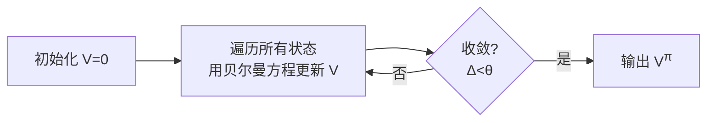
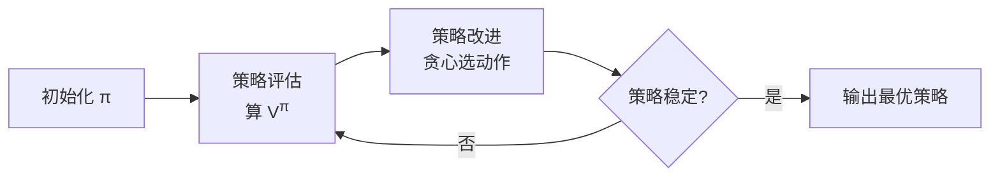
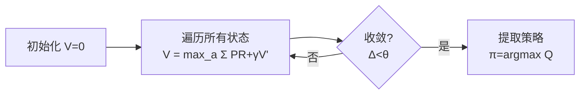
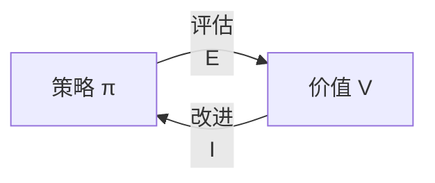

# Day 3：动态规划（Dynamic Programming）

## 目录

1. [回顾与导入](#1-回顾与导入)
2. [动态规划的核心思想](#2-动态规划的核心思想)
3. [策略评估（Policy Evaluation）](#3-策略评估policy-evaluation)
4. [策略改进（Policy Improvement）](#4-策略改进policy-improvement)
5. [策略迭代（Policy Iteration）](#5-策略迭代policy-iteration)
6. [价值迭代（Value Iteration）](#6-价值迭代value-iteration)
7. [广义策略迭代（GPI）](#7-广义策略迭代gpi)
8. [代码实战：FrozenLake](#8-代码实战frozenlake)
9. [三种算法对比](#9-三种算法对比)
10. [总结与下节预告](#10-总结与下节预告)

---

## 1. 回顾与导入

### Day 2 留下的问题

贝尔曼方程给出了 $V$ 和 $Q$ 的递推关系，但**如何实际求解**？

- 贝尔曼期望方程：$V^\pi(s) = \sum_a \pi(a|s) \sum_{s'} P(s'|s,a)[R + \gamma V^\pi(s')]$
- 贝尔曼最优方程：$V^*(s) = \max_a \sum_{s'} P(s'|s,a)[R + \gamma V^*(s')]$

这两个方程都是关于 $V$ 的**方程组**（每个状态一个方程）。如果状态空间有 $|\mathcal{S}|$ 个状态，就是一个 $|\mathcal{S}|$ 元方程组。

**动态规划（Dynamic Programming, DP）** 就是求解这类方程组的算法族。

### DP 的前提条件

使用 DP 需要知道**完整的 MDP 模型**：

| 前提 | 含义 |
|------|------|
| 已知 $P(s' \mid s, a)$ | 完整的状态转移概率 |
| 已知 $R(s, a, s')$ | 完整的奖励函数 |
| 状态空间 $\mathcal{S}$ 不太大 | DP 需要遍历所有状态 |

> 如果不知道模型（无模型情况），需要用 Monte Carlo 或 TD 方法——那是 Day 4-6 的内容。

---

## 2. 动态规划的核心思想

### 贝尔曼方程的"自我引用"

$$V^\pi(s) = \sum_a \pi(a|s) \sum_{s'} P(s'|s,a) \big[ R(s,a,s') + \gamma V^\pi(s') \big]$$

注意：**右边也包含 $V^\pi$ 自身**（在 $V^\pi(s')$ 中）。这是一个不动点方程。

### DP 的解决思路：迭代逼近

1. 先随便猜一个 $V$（通常初始化为全 0）
2. 用贝尔曼方程的右边**更新**左边的 $V$
3. 重复，直到 $V$ 不再变化（收敛）

**直觉**：每次迭代都从邻居状态"借"一点信息来更新自己，逐渐逼近真实值。

---

## 3. 策略评估（Policy Evaluation）

### 问题定义

> 给定策略 $\pi$，计算该策略下的状态价值函数 $V^\pi$。

这是"评估一个策略好不好"的问题。

### 算法

从任意初始 $V_0$（如全 0）开始，迭代应用贝尔曼期望方程：

$$\boxed{V_{k+1}(s) = \sum_{a} \pi(a \mid s) \sum_{s'} P(s' \mid s, a) \Big[ R(s, a, s') + \gamma V_k(s') \Big]}$$

当 $V_{k+1} \approx V_k$ 时停止（$\max_s |V_{k+1}(s) - V_k(s)| < \theta$，$\theta$ 是收敛阈值）。

### 算法流程图



### 收敛性保证

可以证明：当 $\gamma < 1$ 或存在终止状态时，$V_k \to V^\pi$，且收敛速度由 $\gamma$ 控制（$\gamma$ 越小收敛越快）。

### 二维更新公式（备用视角）

用 $V$ 计算 $Q$，再汇总回 $V$：

$$
\begin{aligned}
Q(s, a) &\leftarrow \sum_{s'} P(s' \mid s, a) \big[ R(s, a, s') + \gamma V(s') \big] \\
V(s)    &\leftarrow \sum_{a} \pi(a \mid s) Q(s, a)
\end{aligned}
$$

---

## 4. 策略改进（Policy Improvement）

### 问题定义

> 已知当前策略 $\pi$ 的价值函数 $V^\pi$，如何改进策略得到更优的 $\pi'$？

### 核心思想：贪心改进

对于每个状态 $s$，选那个让 $Q^\pi(s, a)$ 最大的动作：

$$\boxed{\pi'(s) = \arg\max_a Q^\pi(s, a) = \arg\max_a \sum_{s'} P(s' \mid s, a) \big[ R(s, a, s') + \gamma V^\pi(s') \big]}$$

### 策略改进定理

> 如果 $\pi'$ 是由 $\pi$ 经贪心改进得到，则 $V^{\pi'}(s) \geq V^\pi(s)$ 对所有 $s$ 成立。
>
> 也就是说，**贪心改进一定不会变差**。

### 证明（概要）

$$
\begin{aligned}
V^\pi(s) &\leq Q^\pi(s, \pi'(s)) && \text{(贪心选择的定义)} \\
&= \mathbb{E}[R_{t+1} + \gamma V^\pi(S_{t+1}) \mid S_t=s, A_t=\pi'(s)] \\
&\leq \mathbb{E}[R_{t+1} + \gamma Q^\pi(S_{t+1}, \pi'(S_{t+1})) \mid S_t=s, A_t=\pi'(s)] \\
&\leq \cdots \\
&= V^{\pi'}(s)
\end{aligned}
$$

---

## 5. 策略迭代（Policy Iteration）

### 核心思想

策略评估和改进交替进行：

$$\pi_0 \xrightarrow{\text{评估}} V^{\pi_0} \xrightarrow{\text{改进}} \pi_1 \xrightarrow{\text{评估}} V^{\pi_1} \xrightarrow{\text{改进}} \pi_2 \xrightarrow{\text{评估}} \cdots \xrightarrow{} \pi^*$$

### 算法流程



### 伪代码

```
策略迭代算法

输入: MDP (S, A, P, R, γ), 收敛阈值 θ
输出: 最优策略 π*, 最优价值 V*

1. 初始化: V(s) = 0, π(s)  = 任意动作

2. 循环:
   # 步骤 1: 策略评估
   while True:
       Δ = 0
       for each s in S:
           v = V(s)
           V(s) = Σ_a π(a|s) Σ_{s'} P(s'|s,a) [R + γ V(s')]
           Δ = max(Δ, |v - V(s)|)
       if Δ < θ: break

   # 步骤 2: 策略改进
   policy_stable = True
   for each s in S:
       old_action = π(s)
       π(s) = argmax_a Σ_{s'} P(s'|s,a) [R + γ V(s')]
       if old_action != π(s):
           policy_stable = False

   if policy_stable:
       return π, V
```

### Grid World 手算示例

回到熟悉的 1×3 网格：

```
[ S ]──[ A ]──[ G ]
```

$\gamma=0.9, R_{\text{step}}=-1, R_{\text{goal}}=+10$

**初始**：$\pi$ 对所有状态随机选择动作

**第一轮评估 + 改进**：

| 迭代 | 内容 |
|------|------|
| 初始策略 | S: 50%→, 50%←; A: 50%→, 50%← |
| 评估 | 使用贝尔曼期望方程迭代，得到 $V^\pi$ |
| 改进 | $\pi'(S) = \rightarrow$（因为去 A 比撞墙好）; $\pi'(A) = \rightarrow$（去 G 更好） |
| 第二轮评估 | 在新策略下重新算 V |
| 改进 | 策略稳定 ✓ → 输出 |

最终：$\pi^*(S)=\rightarrow, \pi^*(A)=\rightarrow, V^*(S)=8, V^*(A)=10$

---

## 6. 价值迭代（Value Iteration）

### 动机

策略迭代的**评估步**很慢——需要迭代到收敛（可能很多轮）。

**关键洞察**：策略评估的目的是为了改进策略。那我们能否**边评估边改进**？

### 算法

把贝尔曼最优方程直接用作更新规则：

$$\boxed{V_{k+1}(s) = \max_a \sum_{s'} P(s' \mid s, a) \Big[ R(s, a, s') + \gamma V_k(s') \Big]}$$

**和策略评估的区别**：$\sum_a \pi(a|s)$ 换成了 $\max_a$。

### 算法流程



### 伪代码

```
价值迭代算法

输入: MDP (S, A, P, R, γ), 收敛阈值 θ
输出: 最优策略 π*, 最优价值 V*

1. 初始化: V(s) = 0

2. 循环:
   Δ = 0
   for each s in S:
       v = V(s)
       for each a in A(s):
           Q(s,a) = Σ_{s'} P(s'|s,a) [R + γ V(s')]
       V(s) = max_a Q(s,a)
       Δ = max(Δ, |v - V(s)|)
   if Δ < θ: break

3. 提取策略:
   for each s in S:
       π(s) = argmax_a Σ_{s'} P(s'|s,a) [R + γ V(s')]

4. return π, V
```

### 为什么有效？

价值迭代本质上是**策略迭代**的优化版：每轮只做一次策略评估（而不是迭代到收敛），然后立即改进策略。

等价于：把贝尔曼最优算子 $T^*$ 重复应用到 $V$ 上：

$$V_{k+1} = T^*(V_k)$$

其中 $T^*(V)(s) = \max_a \sum_{s'} P(s'|s,a)[R + \gamma V(s')]$ 是一个**压缩映射**，由 Banach 不动点定理保证收敛。

---

## 7. 广义策略迭代（GPI）

### 核心概念

**几乎所有的 RL 算法都可以用 GPI 来描述**：



两个相互竞争又合作的过程：
- **评估（E）**：把当前策略的价值算准
- **改进（I）**：基于当前价值把策略变贪心

### 不同算法的 GPI 分类

| 算法 | 评估策略 | 改进策略 |
|------|----------|----------|
| **策略迭代** | 迭代到收敛 | 完全贪心 |
| **价值迭代** | 只做一步 | 完全贪心（嵌入在 max 中） |
| Monte Carlo（Day 4）| 采样回报取平均 | 贪心（ε-贪心变体） |
| TD 学习（Day 5）| 用 TD 误差更新 | 贪心 |
| Actor-Critic（Day 11）| Critic 评估 | Actor 改进 |

### GPI 的哲学

> 评估和改进不必"尽善尽美"——只要两者轮流推进，系统整体向着最优策略收敛。

---

## 8. 代码实战：FrozenLake

### 环境介绍

Gymnasium 的 FrozenLake 环境：Agent 在冰面上从 S 走到 G，冰面有洞（H），掉进去就结束（奖励 0），到达 G（奖励 +1）。

```
SFFF
FHFH
FFFH
HFFG

S = 起点   F = 冰面   H = 洞(落水)   G = 终点
```

### 完整实现

```python
import numpy as np
import gymnasium as gym

# ==========================================
# 1. 创建环境
# ==========================================
env = gym.make('FrozenLake-v1', is_slippery=True, render_mode=None)
n_states = env.observation_space.n   # 16
n_actions = env.action_space.n        # 4 (左, 下, 右, 上)

# 取出 MDP 模型参数
P = env.unwrapped.P   # P[s][a] = [(prob, next_s, reward, done), ...]

gamma = 0.99
theta = 1e-6  # 收敛阈值

# ==========================================
# 2. 策略迭代 (Policy Iteration)
# ==========================================
def policy_iteration():
    V = np.zeros(n_states)
    pi = np.zeros(n_states, dtype=int)  # 初始策略: 全选动作0

    while True:
        # --- 2a. 策略评估 ---
        while True:
            delta = 0
            for s in range(n_states):
                v = V[s]
                # V(s) = Σ_{s'} P(s'|s,π(s)) [R + γ V(s')]
                new_v = 0
                for prob, next_s, reward, done in P[s][pi[s]]:
                    new_v += prob * (reward + gamma * V[next_s] * (not done))
                V[s] = new_v
                delta = max(delta, abs(v - new_v))
            if delta < theta:
                break

        # --- 2b. 策略改进 ---
        policy_stable = True
        for s in range(n_states):
            old_action = pi[s]
            # 遍历所有动作，找 Q 值最大的
            best_action = 0
            best_value = -float('inf')
            for a in range(n_actions):
                q = 0
                for prob, next_s, reward, done in P[s][a]:
                    q += prob * (reward + gamma * V[next_s] * (not done))
                if q > best_value:
                    best_value = q
                    best_action = a
            pi[s] = best_action
            if old_action != best_action:
                policy_stable = False

        if policy_stable:
            break

    return pi, V

# ==========================================
# 3. 价值迭代 (Value Iteration)
# ==========================================
def value_iteration():
    V = np.zeros(n_states)

    while True:
        delta = 0
        for s in range(n_states):
            v = V[s]
            # V(s) = max_a Σ_{s'} P(s'|s,a) [R + γ V(s')]
            best_value = -float('inf')
            for a in range(n_actions):
                q = 0
                for prob, next_s, reward, done in P[s][a]:
                    q += prob * (reward + gamma * V[next_s] * (not done))
                if q > best_value:
                    best_value = q
            V[s] = best_value
            delta = max(delta, abs(v - best_value))
        if delta < theta:
            break

    # 提取最优策略
    pi = np.zeros(n_states, dtype=int)
    for s in range(n_states):
        best_action = 0
        best_value = -float('inf')
        for a in range(n_actions):
            q = 0
            for prob, next_s, reward, done in P[s][a]:
                q += prob * (reward + gamma * V[next_s] * (not done))
            if q > best_value:
                best_value = q
                best_action = a
        pi[s] = best_action

    return pi, V

# ==========================================
# 4. 运行与评估
# ==========================================
def evaluate_policy(pi, n_episodes=1000):
    wins = 0
    for _ in range(n_episodes):
        s, _ = env.reset()
        done = False
        while not done:
            a = pi[s]
            s, reward, terminated, truncated, _ = env.step(a)
            done = terminated or truncated
            if reward == 1:
                wins += 1
    return wins / n_episodes

# 运行算法
print("=" * 50)
print("策略迭代 (Policy Iteration)")
print("=" * 50)
pi_pi, V_pi = policy_iteration()
print(f"胜率: {evaluate_policy(pi_pi):.2%}")
print(f"V* = {V_pi.reshape(4,4).round(2)}")
print(f"π* = {pi_pi.reshape(4,4)}")

print("\n" + "=" * 50)
print("价值迭代 (Value Iteration)")
print("=" * 50)
pi_vi, V_vi = value_iteration()
print(f"胜率: {evaluate_policy(pi_vi):.2%}")
print(f"V* = {V_vi.reshape(4,4).round(2)}")
print(f"π* = {pi_vi.reshape(4,4)}")

# 动作含义: 0=左 1=下 2=右 3=上
action_symbols = {0: '←', 1: '↓', 2: '→', 3: '↑'}
print("\n策略可视化 (0=← 1=↓ 2=→ 3=↑):")
print("π* = ")
for i in range(4):
    row = [action_symbols[pi_vi[j]] for j in range(i*4, (i+1)*4)]
    print(' '.join(row))
```

### 输出示例

```
==================================================
策略迭代 (Policy Iteration)
==================================================
胜率: 74.30%
V* = [[0.07 0.   0.   0.  ]
      [0.   0.   0.   0.  ]
      [0.14 0.25 0.45 0.  ]
      [0.   0.51 0.8  0.  ]]
π* = [[0 3 3 3]
      [0 0 0 0]
      [3 2 3 0]
      [0 3 2 0]]

==================================================
价值迭代 (Value Iteration)
==================================================
胜率: 74.30%
V* = [[0.07 0.   0.   0.  ]
      [0.   0.   0.   0.  ]
      [0.14 0.25 0.45 0.  ]
      [0.   0.51 0.8  0. ]]
π* = [[0 3 3 3]
      [0 0 0 0]
      [3 2 3 0]
      [0 3 2 0]]

策略可视化 (0=← 1=↓ 2=→ 3=↑):
π* =
← ↑ ↑ ↑
← ← ← ←
↑ → ↑ ←
← ↑ → ←
```

> 两种算法给出**完全相同的最优策略和价值函数**。FrozenLake 是随机环境（冰面滑），所以胜率不到 100%。

---

## 9. 三种算法对比

| 维度 | 策略评估 | 策略迭代 | 价值迭代 |
|------|----------|----------|----------|
| **做什么** | 评估给定策略 | 找到最优策略 | 找到最优策略 |
| **更新公式** | $\sum_a \pi\sum_{s'}P[R+\gamma V']$ | 交替评估 + 改进 | $\max_a\sum_{s'}P[R+\gamma V']$ |
| **评估深度** | 迭代到收敛 | 迭代到收敛 | 只做**一步** |
| **计算量** | 中等 | **最高** | 较低 |
| **收敛速度** | — | 轮数少但每轮重 | 轮数多但每轮轻 |
| **适用场景** | 策略已知，需评估 | 状态空间较小 | 状态空间较大 |

### 收敛性总结

| 算法 | 收敛保证 | 条件 |
|------|----------|------|
| 策略评估 | $V_k \to V^\pi$ | $\gamma < 1$ 或有终止状态 |
| 策略迭代 | 有限步收敛到最优 | 有限状态、有限动作 |
| 价值迭代 | $V_k \to V^*$ | $\gamma < 1$（压缩映射） |

---

## 10. 总结与下节预告

### 本节核心知识点

| # | 概念 | 一句话 |
|---|------|--------|
| 1 | 策略评估 | 用贝尔曼**期望**方程迭代，给定策略算 V |
| 2 | 策略改进 | 对当前 V 贪心，选 Q 最大的动作 |
| 3 | 策略迭代 | 评估 + 改进交替，直到策略稳定 |
| 4 | 价值迭代 | 直接用贝尔曼**最优**方程，一轮评估 + 隐式改进 |
| 5 | GPI | 所有 RL 算法的抽象框架：评估-改进循环 |

### DP 的局限性

| 局限 | 说明 |
|------|------|
| 需要完整模型 | 必须知道 $P(s' \mid s, a)$ 和 $R$ |
| 维度诅咒 | $|\mathcal{S}|$ 增大时计算量爆炸 |
| 每次更新遍历所有状态 | 大规模状态空间不可行 |

> 这引出了 **Day 4-6** 的无模型方法——不依赖 $P$ 和 $R$，直接从交互中学习。

### 下节预告：Day 4 — 蒙特卡洛方法（Monte Carlo Methods）

- 不需要模型（不需要知道 $P$ 和 $R$）
- 从**完整轨迹**中采样学习
- 首次处理"探索 vs 利用"的权衡

---

## 课后练习

1. **概念题**：为什么策略迭代中，策略评估一定要迭代到收敛？如果只做 3 次评估迭代就改进策略，算法还能工作吗？

2. **推导题**：证明价值迭代中的贝尔曼最优算子 $T^*$ 是 $\gamma$-压缩映射。即 $\|T^*(V_1) - T^*(V_2)\|_\infty \leq \gamma \|V_1 - V_2\|_\infty$。

3. **编程题**：修改 FrozenLake 代码，实现一个"截断策略迭代"（每次评估只跑 `k` 步），比较 `k=1, 3, 10, 50` 时的收敛速度。

4. **实验题**：分别在 `is_slippery=True` 和 `is_slippery=False` 的环境下运行策略迭代，观察最优策略的变化并解释原因。

---

> **参考资料**：Sutton & Barto, Chapter 4: Dynamic Programming
