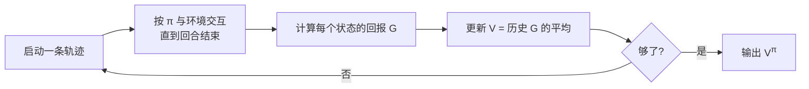

# Day 4：蒙特卡洛方法（Monte Carlo Methods）

## 目录

1. [回顾与导入](#1-回顾与导入)
2. [从有模型到无模型](#2-从有模型到无模型)
3. [MC 的核心思想：用采样替代模型](#3-mc-的核心思想用采样替代模型)
4. [MC 预测：评估给定策略](#4-mc-预测评估给定策略)
5. [MC 控制：寻找最优策略](#5-mc-控制寻找最优策略)
6. [探索与利用的权衡](#6-探索与利用的权衡)
7. [On-Policy MC：ε-贪心策略](#7-on-policy-mcε-贪心策略)
8. [Off-Policy MC：重要性采样](#8-off-policy-mc重要性采样)
9. [代码实战：Blackjack](#9-代码实战blackjack)
10. [MC 与 DP 对比](#10-mc-与-dp-对比)
11. [总结与下节预告](#11-总结与下节预告)

---

## 1. 回顾与导入

### Day 3 建立的 DP 框架

```
策略评估 → 策略改进 → 策略评估 → ... → 最优策略
```

DP 很好，但有一个致命前提：**必须知道 $P(s'|s,a)$ 和 $R(s,a,s')$**。

### 现实世界的问题

| 场景 | 有没有模型？ |
|------|-------------|
| 下围棋 | 有（规则确定）。但状态空间太大，DP 算不动 |
| 自动驾驶 | **没有**。你无法预知前方车辆精确的转移概率 |
| 机器人抓取 | **没有**。摩擦力、物体形变都是未知的 |
| 推荐系统 | **没有**。用户行为无法用转移矩阵描述 |

**今天开始进入无模型（Model-Free）时代**——Agent 只能通过与环境交互获取经验，不知道 $P$ 和 $R$。

---

## 2. 从有模型到无模型

### 有模型 vs 无模型

| | 有模型（DP） | 无模型（MC, TD） |
|----|------------|-----------------|
| 需要 $P(s'\|s,a)$ | 是 | 否 |
| 需要 $R(s,a,s')$ | 是 | 否 |
| 学习方式 | 遍历所有状态 | 从采样轨迹中学 |
| 适用场景 | 棋盘游戏（规则已知） | 真实世界交互 |

### MC 的基本特点

- **从完整轨迹（Episode）中学习**：必须等一个回合结束才能更新
- **使用经验平均代替期望**：$V(s) \approx \text{从 s 出发所有回报的平均值}$
- **每个状态的估计是独立的**：状态 $s$ 的估计不依赖其他状态

---

## 3. MC 的核心思想：用采样替代模型

### 直觉

> 想知道一个骰子抛出 6 的概率？不用推导物理公式，**掷 10000 次然后数**。

MC 的本质就是：**让 Agent 跑很多条轨迹，把回来奖励取平均**。

### 数学形式

DP 用期望：
$$V^\pi(s) = \sum_a \pi(a|s) \sum_{s'} P(s'|s,a) \big[R + \gamma V^\pi(s')\big]$$

MC 用经验平均：
$$V^\pi(s) \approx \frac{1}{N(s)} \sum_{i=1}^{N(s)} G_t^{(i)}$$

其中 $G_t^{(i)}$ 是第 $i$ 次访问状态 $s$ 后的实际回报，$N(s)$ 是访问次数。

### MC 的两种访问方式

| 方式 | 定义 | 特点 |
|------|------|------|
| **首次访问（First-Visit）** | 只统计每条轨迹中**第一次**经过 $s$ 的回报 | 无偏，方差略大 |
| **每次访问（Every-Visit）** | 统计轨迹中**每次**经过 $s$ 的回报 | 渐进无偏，样本更多 |

### 交互流程



---

## 4. MC 预测：评估给定策略

### 问题

> 给定策略 $\pi$，不借助模型，估计 $V^\pi$。

### 算法：First-Visit MC Prediction

```
输入: 策略 π, 回合数 n_episodes
输出: V ≈ V^π

初始化:
    V(s) = 0 (所有状态)
    returns(s) = [] (空列表, 储存每次的回报)

for episode in 1..n_episodes:
    按 π 生成一条轨迹: S0, A0, R1, S1, A1, R2, ..., ST
    G = 0
    for t = T-1, T-2, ..., 0:           # 从后往前遍历
        G = R_{t+1} + γ * G              # 累积回报
        if St 在本条轨迹中首次出现:       # First-Visit
            returns(St).append(G)
            V(St) = mean(returns(St))    # 经验平均
```

### 增量式更新（更实用）

每次存所有回报太占内存，用增量平均：

$$\boxed{V(S_t) \leftarrow V(S_t) + \frac{1}{N(S_t)} \big(G_t - V(S_t)\big)}$$

对于非稳态问题（策略在变），用常数步长 $\alpha$：

$$\boxed{V(S_t) \leftarrow V(S_t) + \alpha \big(G_t - V(S_t)\big)}$$

这个形式非常重要——它是 Day 5 TD 学习的直接前身。

---

## 5. MC 控制：寻找最优策略

### 问题

> 不借助模型，找到最优策略 $\pi^*$。

### 类比 DP 的 GPI 框架

MC 同样遵循 GPI，但评估和改进都变了：

$$\pi \xrightarrow{\text{MC 预测 } Q^\pi} Q^\pi \xrightarrow{\text{贪心改进}} \pi' \xrightarrow{\text{MC 预测 } Q^{\pi'}} \cdots$$

### 为什么用 Q 而不是 V？

DP 中知道 $P(s'|s,a)$，所以有 V 就能贪心改进：
$$\pi'(s) = \arg\max_a \sum_{s'} P(s'|s,a)[R + \gamma V(s')]$$

但 MC 不知道 $P(s'|s,a)$！没有模型，看到 $V(s')$ 也不知道哪个动作更好。

**解决方案**：直接学 $Q^\pi(s,a)$，贪心时直接选：
$$\boxed{\pi'(s) = \arg\max_a Q(s,a)}$$

---

## 6. 探索与利用的权衡

### 贪心策略的问题

如果 Agent 总是选 $Q$ 最大的动作（利用/Exploitation），就永远发现不了可能更好的动作（探索/Exploration）。

> 一个从未被尝试的动作，$Q$ 估计可能不准确，但贪心策略永远不会选它。

### 典型场景

```
有两条路去学校：
- 老路：30 分钟（你每天走，很确定）
- 新路：你没走过，可能只要 20 分钟，也可能要 60 分钟

你永远不走新路 → 永远不会知道它其实更快
```

这就是**探索-利用困境（Exploration-Exploitation Dilemma）**，是 RL 最核心的问题之一。

---

## 7. On-Policy MC：ε-贪心策略

### On-Policy 的含义

> 用于**采样**的策略和用于**评估/改进**的策略是**同一个**。

### ε-贪心策略

以 $1 - \varepsilon$ 的概率选最优动作，以 $\varepsilon$ 的概率随机探索：

$$
\boxed{\pi(a \mid s) = \begin{cases}
1 - \varepsilon + \frac{\varepsilon}{|\mathcal{A}(s)|} & \text{if } a = \arg\max_{a'} Q(s, a') \\[6pt]
\frac{\varepsilon}{|\mathcal{A}(s)|} & \text{otherwise}
\end{cases}}
$$

**性质**：
- $\varepsilon = 0$：纯贪心（只利用）
- $\varepsilon = 1$：纯随机（只探索）
- $\varepsilon = 0.1$：90% 利用，10% 探索（常用取值）

### GLIE 条件

为了让 ε-贪心最终收敛到最优策略，需要满足 **GLIE**（Greedy in the Limit with Infinite Exploration）：

1. **无限探索**：所有 $(s, a)$ 对被访问无数次 → $\lim_{k \to \infty} N_k(s,a) = \infty$
2. **极限贪心**：最终策略趋向纯贪心 → $\lim_{k \to \infty} \pi_k(a|s) = 1$ 仅对最优动作

实现方式：$\varepsilon$ 随训练逐渐衰减：$\varepsilon_k = 1/k$

### GLIE MC 控制算法

```
初始化:
    Q(s,a) = 0 (所有状态-动作对)
    N(s,a) = 0 (访问计数)
    π = ε-贪心策略 (基于 Q)

for each episode:
    按 π 生成一条轨迹
    G = 0
    for t = T-1, T-2, ..., 0:
        G = R_{t+1} + γ * G
        if (St, At) 首次出现:
            N(St, At) += 1
            Q(St, At) += (G - Q(St, At)) / N(St, At)   # 增量平均
            π = ε-贪心策略(基于更新后的 Q)
```

---

## 8. Off-Policy MC：重要性采样

### 动机

On-Policy 的问题：ε-贪心是**妥协**——为了探索，策略必须保持随机性（不能完全贪心）。

**Off-Policy 的想法**：用两个策略！
- **行为策略（behavior policy）$b$**：负责探索，可以很有探索性
- **目标策略（target policy）$\pi$**：我们真正想优化的策略，可以是纯贪心

### 重要性采样（Importance Sampling）

问题：用 $b$ 采样的轨迹，如何估计 $\pi$ 的 Q 值？

**答案**：用**重要性采样比率**加权：

$$\rho_{t:T-1} = \prod_{k=t}^{T-1} \frac{\pi(A_k \mid S_k)}{b(A_k \mid S_k)}$$

用 $\rho$ 给每条轨迹的回报加权：

$$Q^\pi(s,a) = \frac{\sum_i \rho^{(i)} G^{(i)}}{\sum_i \rho^{(i)}}$$

> 这个公式叫**加权重要性采样**。分子分母都有 ρ，使得结果有偏但方差低（RL 中更常用）。

### On-Policy vs Off-Policy

| | On-Policy | Off-Policy |
|----|----------|------------|
| 采样策略 | 就是目标策略 | 与目标策略不同 |
| 探索方式 | ε-贪心（妥协） | 行为策略可完全随机 |
| 最终策略 | ε-最优（不纯贪心） | **纯贪心**，但最优 |
| 数据效率 | 低（在线学习） | 高（可用历史数据） |
| 复杂度 | 简单 | 需要重要性采样 |
| 方差 | 低 | 高（ρ 的乘积） |

---

## 9. 代码实战：Blackjack

### 环境

21 点（Blackjack）：玩家要牌，目标是牌面之和尽可能接近 21 但不超过。超过 21 直接输。

- **状态**：(玩家当前牌面之和, 庄家明牌, 是否有可用 Ace)
- **动作**：0 = 停牌（Stick），1 = 要牌（Hit）
- **奖励**：赢 +1，平 0，输 -1

### 完整实现

```python
import numpy as np
import gymnasium as gym
from collections import defaultdict

env = gym.make('Blackjack-v1', sab=True)
gamma = 1.0
n_episodes = 500000

# ==========================================
# 1. First-Visit MC Prediction (评估给定策略)
# ==========================================
def mc_prediction(policy, n_episodes):
    """评估某个策略的 V 值"""
    V = defaultdict(float)
    returns = defaultdict(list)

    for _ in range(n_episodes):
        s, _ = env.reset()
        episode = []
        done = False
        # 生成轨迹
        while not done:
            a = policy(s)
            next_s, r, terminated, truncated, _ = env.step(a)
            episode.append((s, a, r))
            s = next_s
            done = terminated or truncated

        # 计算回报并更新
        G = 0
        visited = set()
        for t in range(len(episode) - 1, -1, -1):
            s, a, r = episode[t]
            G = r + gamma * G
            if s not in visited:  # First-Visit
                visited.add(s)
                returns[s].append(G)
                V[s] = np.mean(returns[s])
    return V

# ==========================================
# 2. GLIE MC Control (找最优策略)
# ==========================================
def mc_control_epsilon_greedy(n_episodes, epsilon_start=1.0, epsilon_decay=0.99999):
    """On-Policy MC Control - GLIE"""
    Q = defaultdict(lambda: np.zeros(2))  # 2 个动作
    N = defaultdict(lambda: np.zeros(2))
    epsilon = epsilon_start

    for ep in range(n_episodes):
        # 用 ε-贪心策略生成轨迹
        episode = []
        s, _ = env.reset()
        done = False
        while not done:
            if np.random.random() < epsilon:
                a = env.action_space.sample()      # 探索
            else:
                a = np.argmax(Q[s])                 # 利用
            next_s, r, terminated, truncated, _ = env.step(a)
            episode.append((s, a, r))
            s = next_s
            done = terminated or truncated

        # 逆向计算回报并更新 Q
        G = 0
        visited = set()
        for t in range(len(episode) - 1, -1, -1):
            s, a, r = episode[t]
            G = r + gamma * G
            if (s, a) not in visited:  # First-Visit
                visited.add((s, a))
                N[s][a] += 1
                Q[s][a] += (G - Q[s][a]) / N[s][a]  # 增量平均

        epsilon = max(0.01, epsilon * epsilon_decay)  # 衰减探索率

    # 提取最优确定性策略
    pi = {s: np.argmax(Q[s]) for s in Q.keys()}
    return Q, pi

# ==========================================
# 3. 运行
# ==========================================
Q, pi = mc_control_epsilon_greedy(n_episodes)

# 结果显示
print("Blackjack 最优策略 (部分状态):")
print(f"{'玩家牌面':>8} {'庄家明牌':>8} {'可用Ace':>8} {'动作':>6}")
print("-" * 35)
for (player_sum, dealer_card, usable_ace), action in sorted(pi.items())[:15]:
    act_str = "要牌" if action == 1 else "停牌"
    ace_str = "是" if usable_ace else "否"
    print(f"{player_sum:>8} {dealer_card:>8} {ace_str:>8} {act_str:>6}")

# 统计: 有多少状态选择要牌 vs 停牌
hits = sum(1 for v in pi.values() if v == 1)
sticks = len(pi) - hits
print(f"\n总状态数: {len(pi)}")
print(f"要牌: {hits}, 停牌: {sticks}")

# 可视化某个状态的价值
print(f"\n示例 Q 值 (有可用Ace, 庄家明牌=5):")
for psum in range(4, 22):
    s = (psum, 5, True)
    if s in Q:
        print(f"  玩家={psum:>2}: Q(停牌)={Q[s][0]:.2f}, Q(要牌)={Q[s][1]:.2f}")
```

### 输出示例

```
Blackjack 最优策略 (部分状态):
   玩家牌面   庄家明牌    可用Ace    动作
-----------------------------------
       4        1       是    要牌
       4        2       是    要牌
       4        3       是    要牌
       ...
      17        5       是    停牌
      18        5       是    停牌
      19        5       是    停牌
      20        5       是    停牌
      12        6       否    要牌
      13        6       否    停牌
      ...

总状态数: 278
要牌: 156, 停牌: 122

示例 Q 值 (有可用Ace, 庄家明牌=5):
  玩家=12: Q(停牌)=-0.14, Q(要牌)=-0.11
  玩家=17: Q(停牌)= 0.12, Q(要牌)=-0.39
  玩家=19: Q(停牌)= 0.63, Q(要牌)=-0.54
```

---

## 10. MC 与 DP 对比

| 维度 | DP | MC |
|------|-----|-----|
| **需要模型** | 是（$P, R$） | 否 |
| **更新时机** | 每次扫描全部状态 | 等回合结束 |
| **自举（Bootstrapping）** | 是（用 $V(s')$） | **否**（用完整回报 $G$） |
| **状态独立性** | 否（状态互相影响） | 是（每个状态独立估计） |
| **适用场景** | 有模型 + 状态少 | 有终止状态 + 能采样 |
| **偏差** | 受模型误差影响 | **无偏估计** |
| **方差** | 低 | **高**（回报的随机性） |

### MC 的优势

1. **不需要模型**：这是最大的突破
2. **最优收敛**：在某些条件下，MC 能找到真正的最优策略（无模型偏差）
3. **状态独立**：只关心访问过的状态，不被无关状态干扰
4. **对马尔可夫性不敏感**：不需要满足马尔可夫假设

### MC 的劣势

1. **必须等回合结束**：不能在线、增量地学习
2. **只在有终止状态的环境有效**：连续任务（如股票交易）不能用
3. **高方差**：回报 $G$ 随轨迹长度方差累积
4. **探索不足时偏差大**

---

## 11. 总结与下节预告

### 本节核心知识点

| # | 概念 | 公式/描述 |
|---|------|----------|
| 1 | MC 核心思想 | $V(s) = \frac{1}{N}\sum G_t^{(i)}$，用采样代替期望 |
| 2 | First-Visit MC | 每条轨迹只取第一次访问的回报 |
| 3 | 增量更新 | $V \leftarrow V + \alpha(G - V)$ |
| 4 | ε-贪心 | 以 $1-\varepsilon$ 贪心，$\varepsilon$ 随机探索 |
| 5 | GLIE | $\varepsilon \to 0$ 同时保证无限探索 |
| 6 | 重要性采样 | $\rho = \prod \frac{\pi(a\|s)}{b(a\|s)}$ |
| 7 | On-Policy vs Off-Policy | 同策略 vs 异策略 |
| 8 | MC vs DP | MC 无模型、无自举、高方差 |

### 关键突破

> **MC 首次让 RL 可以在不知道环境模型的情况下学习**。代价是：必须等回合结束，且方差高。

### 下节预告：Day 5 — 时序差分学习（TD Learning）

TD 是 MC 和 DP 的完美结合：
- 像 MC 一样**不需要模型**（从经验学）
- 像 DP 一样**可以自举**（不用等回合结束就能更新）
- 核心公式：$V(S_t) \leftarrow V(S_t) + \alpha [R_{t+1} + \gamma V(S_{t+1}) - V(S_t)]$

那个括号里的东西就是 "TD 误差"——RL 中最核心的概念之一。

---

## 课后练习

1. **概念题**：为什么 MC 必须学到 $Q(s,a)$ 而不是 $V(s)$ 才能做策略改进？DP 为什么学 $V$ 就够了？

2. **推导题**：证明 First-Visit MC 对 $V^\pi$ 的估计是无偏的。即 $\mathbb{E}[V_{\text{MC}}(s)] = V^\pi(s)$。

3. **编程题**：修改 Blackjack 代码，实现 Every-Visit MC，比较与 First-Visit 的收敛速度。

4. **实验题**：对比三种 $\varepsilon$ 衰减策略——`1/k`、指数衰减、固定 $\varepsilon=0.1$——哪种在 Blackjack 上最终表现最好？为什么？

---

> **参考资料**：Sutton & Barto, Chapter 5: Monte Carlo Methods
