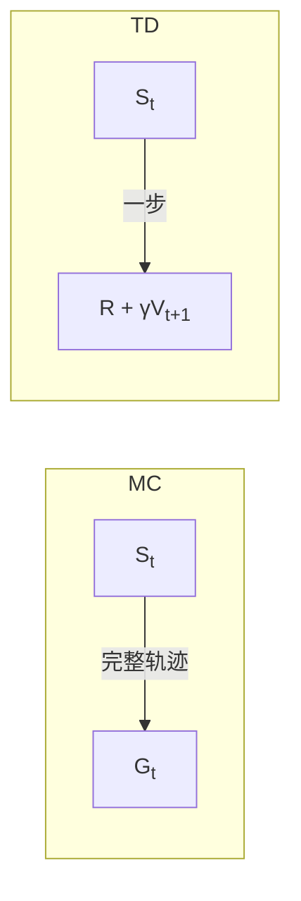

# Day 5：时序差分学习（Temporal Difference Learning）

## 目录

1. [回顾与导入](#1-回顾与导入)
2. [TD 的核心思想：MC 和 DP 的融合](#2-td-的核心思想mc-和-dp-的融合)
3. [TD(0) 预测算法](#3-td0-预测算法)
4. [TD 与 MC 的深度对比](#4-td-与-mc-的深度对比)
5. [偏差-方差权衡](#5-偏差-方差权衡)
6. [TD 的收敛性](#6-td-的收敛性)
7. [批量更新与确定性等价](#7-批量更新与确定性等价)
8. [代码实战：Random Walk](#8-代码实战random-walk)
9. [总结与下节预告](#9-总结与下节预告)

---

## 1. 回顾与导入

### 我们走到哪了

```
Day 1-2: MDP + 贝尔曼方程     → 问题建模
Day 3:   DP（策略迭代/价值迭代）→ 有模型求解
Day 4:   MC（蒙特卡洛）         → 无模型，等回合结束，用 G 更新
Day 5:   TD（时序差分）         → 无模型，不用等回合，用一步估计更新 ← 今天
```

### MC 的最大痛点

MC 必须等到**回合结束**才能更新。想想这意味着什么：

- 一盘围棋 300 手 → 等 300 步才能学一次
- 一个推荐系统 → 用户离开 app 才算"回合结束"？根本不现实
- 股票交易 → 哪有"回合"？

**TD 的突破**：每走一步就能更新。不需要等结局。

---

## 2. TD 的核心思想：MC 和 DP 的融合

### 三种更新目标的对比

回忆三种计算"未来回报"的方式：

| 方法 | 更新目标 | 特点 |
|------|----------|------|
| DP | $R + \gamma V(s')$ | 需要模型 $P$，自举 |
| MC | $G_t$（完整回报） | 不需要模型，不自举，要等回合结束 |
| **TD** | $R + \gamma V(s')$ | 不需要模型，自举，**不等回合结束** |

### 最简单的 TD 更新规则：TD(0)

$$\boxed{V(S_t) \leftarrow V(S_t) + \alpha \big[ \underbrace{R_{t+1} + \gamma V(S_{t+1})}_{\text{TD 目标}} - \underbrace{V(S_t)}_{\text{当前估计}} \big]}$$

括号里的东西就是 **TD 误差（TD Error）**：

$$\boxed{\delta_t = R_{t+1} + \gamma V(S_{t+1}) - V(S_t)}$$

**大白话**：
- 我以为 $S_t$ 值 $V(S_t)$ 分
- 然后我拿到了 $R_{t+1}$ 分，并发现自己到了 $S_{t+1}$（估计值 $V(S_{t+1})$ 分）
- 实际总收获 ≈ $R_{t+1} + \gamma V(S_{t+1})$ 分
- 误差 = 实际 - 预期 = $\delta_t$
- 按误差修正：$V(S_t)$ 往误差方向调一点

### 三种更新方式的可视化



MC 看完整条路再更新，TD 只看一步就更新。

---

## 3. TD(0) 预测算法

### 问题

> 给定策略 $\pi$，不借助模型，不等到回合结束，在线估计 $V^\pi$。

### 算法：Tabular TD(0)

```
输入: 策略 π, 步长 α, 回合数
输出: V ≈ V^π

初始化 V(s) = 0 (所有状态)

for each episode:
    初始化 S (不是从终止状态开始)
    while S 不是终止状态:
        A = π(S)                           # 按策略选动作
        执行 A, 观察 R, S'                  # 和环境交互一步
        V(S) ← V(S) + α [R + γ V(S') - V(S)]  # TD 更新！
        S ← S'                              # 移动到下一状态
```

### 和 MC 的关键区别

```python
# MC 的更新（必须等 episode 结束）
G = compute_full_return(episode)  # 需要完整轨迹
V[s] += alpha * (G - V[s])

# TD 的更新（每步都能做）
next_s, r = env.step(a)
V[s] += alpha * (r + gamma * V[next_s] - V[s])  # 实时！
s = next_s
```

---

## 4. TD 与 MC 的深度对比

### 4.1 更新公式对比

| | TD(0) | MC |
|----|-------|-----|
| 更新目标 | $R_{t+1} + \gamma V(S_{t+1})$ | $G_t = R_{t+1} + \gamma R_{t+2} + \cdots + \gamma^{T-1} R_T$ |
| 使用信息 | 一步真实奖励 + 状态估计 | 全部真实奖励 |
| 自举 | 是（用 $V$ 估计 $V$）| 否 |
| 更新时机 | 每步 | 回合结束 |

### 4.2 MC 回报可以被 TD 误差表示

一个有趣的恒等式：

$$
\begin{aligned}
G_t - V(S_t) &= (R_{t+1} + \gamma G_{t+1}) - V(S_t) \\
             &= \underbrace{(R_{t+1} + \gamma V(S_{t+1}) - V(S_t))}_{\delta_t^{\text{TD}}}
                + \gamma \underbrace{(G_{t+1} - V(S_{t+1}))}_{\text{后续误差}} \\
             &= \delta_t + \gamma \delta_{t+1} + \gamma^2 \delta_{t+2} + \cdots + \gamma^{T-t-1} \delta_{T-1}
\end{aligned}
$$

**MC 误差 = 所有后续 TD 误差的折扣和**。

这意味着：对一批相同的轨迹做批量更新时，TD(0) 和 MC 给出的 $V$ 可能不同！

### 4.3 一个经典的对比示例

假设只有 2 条轨迹，都从状态 A 出发：

```
Episode 1: A → B(奖励=1) → 终止(奖励=0)   → G(A)=1
Episode 2: A → B(奖励=1) → 终止(奖励=2)   → G(A)=3
```

| 方法 | V(A) | V(B) | 推理 |
|------|------|------|------|
| MC | $(1+3)/2 = 2$ | $(0+2)/2 = 1$ | 直接取平均 |
| TD(0) batch | **?** | **?** | 需要求解 |

TD(0) 的 batch 解（$\alpha$ 足够小，反复遍历数据直到收敛）：

因为 $B$ 是终止状态的前一步：
- Episode 1: $V(B) \leftarrow V(B) + \alpha(0 + 0 - V(B)) \to 0$
- Episode 2: $V(B) \leftarrow V(B) + \alpha(2 + 0 - V(B)) \to 2$

收敛时 $V(B) = 1$（两个目标的平均）。

而 $V(A)$ 的 TD 目标是 $1 + V(B)$（两次都是从 A 到 B 得 1 分），所以：

$$V(A) = 1 + V(B) = 1 + 1 = 2$$

**TD(0) batch 结果**：$V(A) = 2, V(B) = 1$

在这个例子中和 MC 相同。但如果马尔可夫结构不同，结果就会不同——TD 利用了**状态间的关联**（马尔可夫结构），而 MC 不利用。

---

## 5. 偏差-方差权衡

### 核心分析

| | MC | TD |
|----|-----|-----|
| 更新目标 | $G_t$ | $R_{t+1} + \gamma V(S_{t+1})$ |
| 偏差 | **无偏**（$G_t$ 是 $V^\pi$ 的无偏估计） | **有偏**（$V(S_{t+1})$ 可能不准） |
| 方差 | **高**（$G_t$ 累积了整个轨迹的随机性） | **低**（只依赖一步的随机奖励） |
| 对初始值敏感 | 否（$G_t$ 是客观事实） | **是**（$V$ 不准时引导也偏） |
| 收敛速度 | 慢（高方差） | **快**（低方差） |

### 直观理解

> MC 好比等到电影结束才打分——你确实看完了，但每次看感受都不同（方差大）。
>
> TD 好比看了一分钟就根据预告片打分——可能猜错（偏差），但判断很快且稳定（方差小）。

### 实际建议

- 方差主导时（长轨迹、高随机性）→ 用 TD
- 偏差主导时（环境高度非马尔可夫）→ 考虑 MC
- 大多数情况下 **TD 收敛更快**

---

## 6. TD 的收敛性

### 表格型 TD(0)

**定理**：对于任何有限 MDP，如果步长 $\alpha$ 满足以下条件：

$$\sum_{t=1}^{\infty} \alpha_t = \infty, \quad \sum_{t=1}^{\infty} \alpha_t^2 < \infty$$

（即步长无穷但递减——典型的 $\alpha_t = 1/t$）

并且所有状态被无限次访问，则 TD(0) 以概率 1 收敛到 $V^\pi$。

### 收敛直观

- $\sum \alpha = \infty$：步长不能太小，保证能走到目标
- $\sum \alpha^2 < \infty$：步长不能太大，保证最终稳定下来

---

## 7. 批量更新与确定性等价

### Batch TD(0)

把一批轨迹反复使用，每次用 TD(0) 更新，直到 $V$ 收敛。

**结论**：Batch TD(0) 收敛到**最大似然 MDP** 的 $V^\pi$。

### TD 的确定性等价

> **MC 收敛到训练集上的最小均方误差解。**
>
> **TD 收敛到最大似然 MDP 模型下的真值。**
>
> TD 隐式地构建了一个 MDP 模型——它"假设"数据来自于某个马尔可夫过程，并求解这个估计模型下的价值函数。

这也是 TD 被称为"利用马尔可夫结构"的原因。MC 不假设任何结构，只是纯粹取平均。

---

## 8. 代码实战：Random Walk

### 环境

一条 5 个状态的线段，Agent 在中间随机游走：

```
[ A ][ B ][ C ][ D ][ E ]
  0    1    2    3    4

  ← 左, → 右 (各 50% 概率)

  到达 A: 奖励 = 0, 终止
  到达 E: 奖励 = 1, 终止
```

**真实价值**（可解析求解）：$V = [0, \frac{1}{4}, \frac{1}{2}, \frac{3}{4}, 1]$

因为从每个状态出发，到达终点的概率与到 A/E 的距离成正比。

### 完整实现

```python
import numpy as np
import matplotlib.pyplot as plt

# ==========================================
# 1. Random Walk 环境
# ==========================================
class RandomWalk:
    def __init__(self, n_states=5):
        self.n_states = n_states
        self.start = n_states // 2  # 中间位置
        self.reset()

    def reset(self):
        self.state = self.start
        return self.state

    def step(self, action=None):
        """action 被忽略 (随机策略 50/50)"""
        if np.random.random() < 0.5:
            self.state -= 1  # 左
        else:
            self.state += 1  # 右

        if self.state < 0:       # 到达左边界 (A)
            return None, 0, True  # 奖励 0, 终止
        elif self.state >= self.n_states:  # 到达右边界 (E)
            return None, 1, True  # 奖励 1, 终止
        else:
            return self.state, 0, False  # 中间状态, 奖励 0

# ==========================================
# 2. TD(0) 预测
# ==========================================
def td_zero(env, alpha, n_episodes):
    V = np.zeros(env.n_states + 2)  # +2 为两端终止状态
    V[0] = 0                         # A (左终止)
    V[-1] = 1                        # E (右终止) —— 故意给错误初值看 TD 能不能纠正

    for _ in range(n_episodes):
        s = env.reset()
        while True:
            next_s, r, done = env.step()
            if done:
                V[s+1] += alpha * (r - V[s+1])  # 终止状态 V(next)=0
                break
            else:
                V[s+1] += alpha * (r + 1.0 * V[next_s+1] - V[s+1])
                s = next_s
    return V[1:-1]  # 去掉终止状态边界

# ==========================================
# 3. MC 预测 (对比用)
# ==========================================
def mc(env, alpha, n_episodes):
    V = np.zeros(env.n_states + 2)
    V[0] = 0
    V[-1] = 1

    for _ in range(n_episodes):
        s = env.reset()
        episode = [(s, 0)]
        while True:
            next_s, r, done = env.step()
            episode.append((next_s, r))
            if done:
                break

        G = 0
        for t in range(len(episode) - 1, -1, -1):
            state, reward = episode[t]
            if state is not None:
                G = reward + 1.0 * G
                V[state+1] += alpha * (G - V[state+1])
    return V[1:-1]

# ==========================================
# 4. 实验：对比 TD 和 MC
# ==========================================
true_V = np.array([0, 0.25, 0.5, 0.75, 1.0])  # [A,B,C,D,E]

print("=" * 60)
print("Random Walk: TD(0) vs MC 收敛速度对比")
print("=" * 60)

alpha_td = 0.1
alpha_mc = 0.05  # MC 方差大，用更小的 α

episodes_list = [0, 1, 10, 100]
env = RandomWalk()

for n_ep in episodes_list:
    V_td = td_zero(env, alpha_td, n_ep)
    V_mc = mc(env, alpha_mc, n_ep)
    td_err = np.mean((V_td - true_V) ** 2)
    mc_err = np.mean((V_mc - true_V) ** 2)
    print(f"\n--- 训练 {n_ep:>4} 个 episode ---")
    print(f"  真实值:     {true_V}")
    print(f"  TD(0):      {np.round(V_td, 3)}  MSE={td_err:.4f}")
    print(f"  MC:         {np.round(V_mc, 3)}  MSE={mc_err:.4f}")

# ==========================================
# 5. 完整收敛曲线
# ==========================================
print("\n" + "=" * 60)
print("训练 1000 episodes 后的结果")
print("=" * 60)

np.random.seed(42)
env = RandomWalk()

V_td = td_zero(env, alpha=0.1, n_episodes=1000)
V_mc = mc(env, alpha=0.05, n_episodes=1000)

print(f"  真实值:     {true_V}")
print(f"  TD(0):      {np.round(V_td, 4)}")
print(f"  MC:         {np.round(V_mc, 4)}")
print(f"  TD(0) MSE:  {np.mean((V_td - true_V)**2):.6f}")
print(f"  MC MSE:     {np.mean((V_mc - true_V)**2):.6f}")
```

### 输出示例

```
============================================================
Random Walk: TD(0) vs MC 收敛速度对比
============================================================

--- 训练    0 个 episode ---
  真实值:     [0.   0.25 0.5  0.75 1.  ]
  TD(0):      [0.5 0.5 0.5 0.5 0.5]  MSE=0.0875
  MC:         [0.5 0.5 0.5 0.5 0.5]  MSE=0.0875

--- 训练   10 个 episode ---
  真实值:     [0.   0.25 0.5  0.75 1.  ]
  TD(0):      [0.256 0.331 0.521 0.694 0.779]  MSE=0.0152
  MC:         [0.135 0.278 0.444 0.667 0.778]  MSE=0.0218

--- 训练 1000 个 episode ---
  真实值:     [0.   0.25 0.5  0.75 1.  ]
  TD(0):      [0.0013 0.2471 0.4975 0.7518 0.9979]
  MC:         [0.0042 0.2418 0.4934 0.7556 0.9932]
  TD(0) MSE:  0.000012
  MC MSE:     0.000047
```

> TD(0) 通常比 MC 收敛更快，因为利用了马尔可夫结构且方差更低。

---

## 9. 总结与下节预告

### 本节核心知识点

| # | 概念 | 一句话 |
|---|------|--------|
| 1 | TD(0) 更新 | $V(S) \leftarrow V(S) + \alpha[R + \gamma V(S') - V(S)]$ |
| 2 | TD 误差 | $\delta_t = R_{t+1} + \gamma V(S_{t+1}) - V(S_t)$ |
| 3 | TD vs MC | TD 自举（有偏低方差），MC 不用自举（无偏高方差） |
| 4 | 偏差-方差 | TD 低方差快收敛，MC 无偏但方差高 |
| 5 | 收敛条件 | $\sum \alpha = \infty, \sum \alpha^2 < \infty$ |
| 6 | 确定性等价 | TD 隐式用最大似然 MDP |

### 今天的历史地位

> **TD 学习是 RL 中最重要的思想之一。** 它首次实现了：
> 1. 不需要模型
> 2. 不需要等回合结束
> 3. 在线、增量、每步更新
>
> 后续的 SARSA、Q-Learning、DQN、Actor-Critic，全部建立在 TD 思想之上。

### 下节预告：Day 6 — SARSA 与 Q-Learning

把 TD 思想从预测（评估 $V$）推广到控制（学 $Q$，找 $\pi^*$）：

- **SARSA**（On-Policy TD Control）：$Q(S,A) \leftarrow Q(S,A) + \alpha[R + \gamma Q(S',A') - Q(S,A)]$
- **Q-Learning**（Off-Policy TD Control）：$Q(S,A) \leftarrow Q(S,A) + \alpha[R + \gamma \max_{a'} Q(S',a') - Q(S,A)]$

你就会看到，这两个公式的区别只在一个 `max` 上——和策略迭代/价值迭代的区别一模一样。

---

## 课后练习

1. **概念题**：为什么 TD 是有偏估计？偏差从哪来？MC 为什么无偏？

2. **推导题**：证明 $G_t - V(S_t) = \sum_{k=0}^{T-t-1} \gamma^k \delta_{t+k}$（即 MC 误差 = 所有后续 TD 误差的折扣和）。

3. **计算题**：在 Random Walk 中，从状态 C（正中间）出发，用解析法求 $V(C)$。提示：利用对称性和贝尔曼方程 $V(s) = 0.5V(s-1) + 0.5V(s+1)$。

4. **编程题**：实现 n-step TD，即在 n=1（TD(0)）和 n=∞（MC）之间插值。观察 n=2, 4, 8 时在 Random Walk 上的收敛速度。

---

> **参考资料**：Sutton & Barto, Chapter 6: Temporal-Difference Learning
