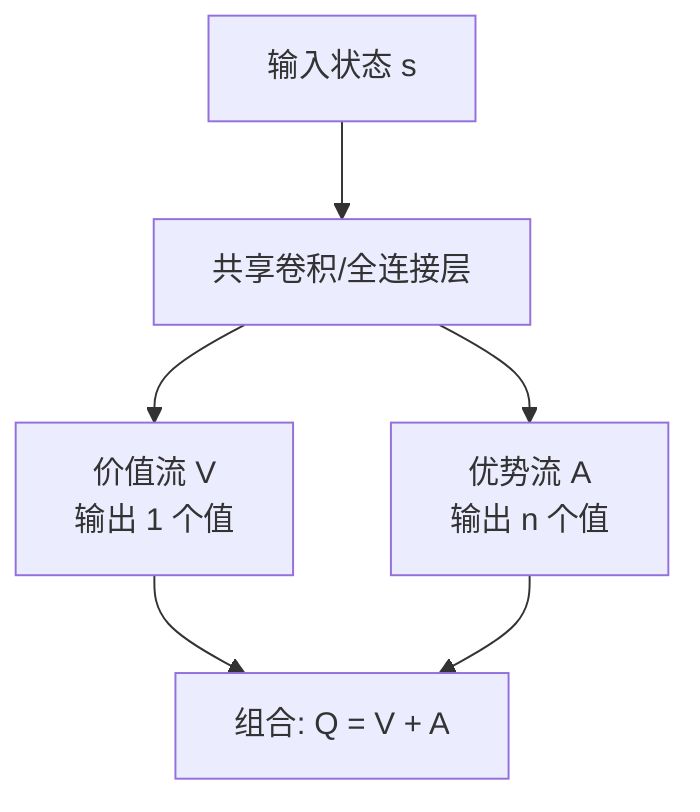

# Day 9：DQN 改进（Double DQN, Dueling DQN, PER）

## 目录

1. [回顾与导入：DQN 的三个遗留问题](#1-回顾与导入dqn-的三个遗留问题)
2. [Double DQN：消除 Q 值过估计](#2-double-dqn消除-q-值过估计)
3. [Dueling DQN：分离状态价值与优势](#3-dueling-dqn分离状态价值与优势)
4. [PER：优先经验回放](#4-per优先经验回放)
5. [Rainbow：集大成者](#5-rainbow集大成者)
6. [代码实战：三种改进对比](#6-代码实战三种改进对比)
7. [算法对比总结](#7-算法对比总结)
8. [总结与下节预告](#8-总结与下节预告)

---

## 1. 回顾与导入：DQN 的三个遗留问题

Day 8 的 DQN 引入了经验回放和目标网络，解决了表格型方法的扩展性问题。但仍存在三个关键缺陷：

| 问题 | 原因 | 后果 | 解决方案 |
|------|------|------|---------|
| **Q 值过估计** | $\max$ 操作引入正偏差 | 价值估计偏高，策略次优 | Double DQN |
| **V 和 A 混合** | 网络只输出一个 Q 值 | 状态本身好坏被动作差异掩盖 | Dueling DQN |
| **均匀采样** | 所有经验等概率被采样 | 重要经验被淹没，学习慢 | PER |

### 为什么这三个问题很重要？

DQN 在 Atari 上达到了人类水平，但后续研究表明：
- Q 值过估计在某些游戏上导致策略严重退化
- Dueling DQN 在状态价值比动作选择更重要的场景下提升显著
- PER 将样本效率提升了 2-3 倍

---

## 2. Double DQN：消除 Q 值过估计

### 2.1 问题：max 操作的正偏差

回顾 Q-Learning / DQN 的 TD 目标：

$$y = r + \gamma \max_{a'} Q(s', a'; \theta^-)$$

这里 $\max$ 操作有一个数学性质：**即使 $Q$ 是无偏估计，取 max 后也会产生正偏差**。

**直觉**：假设你估计 10 个动作的 Q 值，每个估计都有随机噪声。最大值最可能是"真值高 + 噪声正"的那个，而不是真值最高的那个。

### 2.2 手算示例：max 导致过估计

假设真实 $Q^*(s', a')$ 对 3 个动作分别为 $[1, 2, 3]$。网络估计有随机误差，得到 $\hat{Q} = [1.5, 2.8, 3.3]$。

$$\max \hat{Q} = 3.3 > Q^*_{\max} = 3$$

过估计量 = $3.3 - 3 = 0.3$。

随着动作空间增大，过估计更严重——因为从更多噪声估计中取 max，更容易选中"运气好"的那个。

### 2.3 Double DQN 的核心思想

**将"选动作"和"评估动作"分离**：

- **选动作**：用主网络 $\theta$（更准确，因为一直在更新）
- **评估动作**：用目标网络 $\theta^-$（更稳定）

$$\boxed{y_{\text{Double}} = r + \gamma \hat{Q}\Big(s', \underbrace{\arg\max_{a'} \hat{Q}(s', a'; \theta)}_{\text{主网络选动作}}; \theta^-\Big)}$$

**公式拆解**：

| 步骤 | 用哪个网络 | 做什么 |
|------|-----------|--------|
| 第一步 | 主网络 $\theta$ | 找到 Q 值最大的动作 $a^* = \arg\max_{a'} \hat{Q}(s', a'; \theta)$ |
| 第二步 | 目标网络 $\theta^-$ | 用 $a^*$ 计算 Q 值 $\hat{Q}(s', a^*; \theta^-)$ |

### 2.4 DQN vs Double DQN 目标对比

| 算法 | TD 目标 | 选动作 | 评估动作 |
|------|--------|--------|---------|
| DQN | $r + \gamma \max_{a'} Q(s',a';\theta^-)$ | 目标网络 | 目标网络（同一个） |
| **Double DQN** | $r + \gamma Q(s', \arg\max_{a'} Q(s',a';\theta); \theta^-)$ | **主网络** | 目标网络（分离的） |

> DQN 用同一个网络既选动作又评估，"自己选自己评"，自然偏向乐观估计。
> Double DQN 让"别人来评"，更客观。

### 2.5 为什么能消除过估计？

主网络选动作：$a^* = \arg\max_{a'} \hat{Q}(s', a'; \theta)$——选出 Q 值最大的动作

目标网络评估：$\hat{Q}(s', a^*; \theta^-)$——用独立参数评估该动作

因为 $\theta^-$ 和 $\theta$ 参数不同，$\hat{Q}(s', a^*; \theta^-)$ 不太可能是所有动作中目标网络的最大值，因此不会系统性偏高。

### 2.6 伪代码差异

```
# DQN 原版
a* = argmax Q(s', a; θ⁻)            # 目标网络选+评
y = r + γ * Q(s', a*; θ⁻)

# Double DQN
a* = argmax Q(s', a; θ)             # 主网络选
y = r + γ * Q(s', a*; θ⁻)           # 目标网络评
```

---

## 3. Dueling DQN：分离状态价值与优势

### 3.1 动机：有些状态，动作选择不重要

考虑一个开车场景：
- 在空旷直路上（状态好），无论左转右转都不太影响结果
- 在拥堵路口（状态差），选择哪条路至关重要

DQN 只输出一个 $Q(s,a)$ 值，无法区分"状态本身好不好"和"在这个状态下动作差异有多大"。

### 3.2 Q 值的分解

Q 值可以自然分解为两部分：

$$\boxed{Q(s, a) = \underbrace{V(s)}_{\text{状态价值}} + \underbrace{A(s, a)}_{\text{优势函数}}}$$

**各部分含义**：

| 符号 | 名称 | 含义 |
|------|------|------|
| $V(s)$ | 状态价值 | 处于状态 $s$ 的平均好坏程度 |
| $A(s,a)$ | 优势函数 | 在状态 $s$ 选择动作 $a$ 比"平均水平"好多少 |

**优势函数的定义**：

$$A(s, a) = Q(s, a) - V(s)$$

**含义**：$A(s,a) > 0$ 表示动作 $a$ 比平均水平好；$A(s,a) < 0$ 表示比平均水平差。

### 3.3 手算示例

假设在状态 $s$ 下，3 个动作的真实 Q 值为 $Q = [3, 5, 4]$。

$$V(s) = \max_a Q(s,a) = 5 \quad \text{（最优策略下的价值）}$$

$$A(s, a_1) = 3 - 5 = -2, \quad A(s, a_2) = 5 - 5 = 0, \quad A(s, a_3) = 4 - 5 = -1$$

最优动作 $a_2$ 的优势为 0（因为 $V$ 就是用它算的），其他动作优势为负。

### 3.4 Dueling 网络架构

Dueling DQN 将网络拆分为两个流：



**组合公式**：

$$\boxed{\hat{Q}(s, a; \theta, \alpha, \beta) = \underbrace{V(s; \theta, \beta)}_{\text{价值流}} + \Big( \underbrace{A(s, a; \theta, \alpha)}_{\text{优势流}} - \frac{1}{|\mathcal{A}|} \sum_{a'} A(s, a'; \theta, \alpha) \Big)}$$

**公式拆解**：

| 符号 | 含义 |
|------|------|
| $\theta$ | 共享层参数 |
| $\alpha$ | 优势流独有参数 |
| $\beta$ | 价值流独有参数 |
| $V(s; \theta, \beta)$ | 价值流输出：状态 $s$ 的价值（标量） |
| $A(s, a; \theta, \alpha)$ | 优势流输出：每个动作的优势（向量） |
| $\frac{1}{\|\mathcal{A}\|} \sum A$ | 优势流的均值（减去它确保可辨识性） |

### 3.5 为什么减去优势均值？

直接组合 $Q = V + A$ 存在**可辨识性问题**：$V$ 和 $A$ 可以同时加减一个常数，$Q$ 不变。

$$Q = (V + c) + (A - c) = V + A$$

网络无法唯一确定 $V$ 和 $A$，梯度可能不稳定。

**解决方案**：强制优势函数的均值为 0：

$$A(s, a) - \frac{1}{|\mathcal{A}|} \sum_{a'} A(s, a') = 0 \quad \text{（对最优动作）}$$

这样 $V(s)$ 就等于最优动作的 Q 值，$A$ 表示相对优势。

### 3.6 Dueling DQN 的优势

| 优势 | 说明 |
|------|------|
| **状态价值学习更高效** | 即使某些 $(s,a)$ 对没被访问，$V(s)$ 仍能从其他动作的经验中学习 |
| **动作差异更清晰** | 优势流直接输出"哪个动作比平均好多少" |
| **对噪声更鲁棒** | 状态价值的梯度来自所有动作，更稳定 |

---

## 4. PER：优先经验回放

### 4.1 问题：均匀采样的浪费

DQN 从回放池均匀采样，每条经验被采到的概率相同。但不同经验的"学习价值"差异巨大：

- TD 误差大的经验：网络预测和目标差距大 → **值得学习**
- TD 误差小的经验：网络已经学会了 → **重复学习浪费**

### 4.2 核心思想：TD 误差越大，优先级越高

定义经验 $i$ 的优先级：

$$\boxed{p_i = |\delta_i| + \epsilon}$$

**公式拆解**：

| 符号 | 含义 |
|------|------|
| $p_i$ | 经验 $i$ 的优先级 |
| $\|\delta_i\|$ | TD 误差的绝对值，越大说明网络越"意外" |
| $\epsilon$ | 小常数（如 $10^{-5}$），防止优先级为 0（保证每条经验都有机会被采样） |

### 4.3 采样概率

从优先级到采样概率有两种方式：

**随机比例采样（Stochastic Prioritization）**：

$$\boxed{P(i) = \frac{p_i^\alpha}{\sum_k p_k^\alpha}}$$

**公式拆解**：

| 符号 | 含义 |
|------|------|
| $P(i)$ | 经验 $i$ 被采样的概率 |
| $p_i^\alpha$ | 优先级的 $\alpha$ 次方 |
| $\alpha$ | 优先级指数，$\alpha=0$ 退化为均匀采样，$\alpha=1$ 完全按优先级 |
| 分母 | 归一化因子，确保概率和为 1 |

典型 $\alpha = 0.6$，在优先级和均匀之间取平衡。

### 4.4 重要性采样权重（关键！）

按优先级采样**改变了数据分布**，导致梯度估计有偏。需要用重要性采样权重修正：

$$\boxed{w_i = \left( \frac{1}{N} \cdot \frac{1}{P(i)} \right)^\beta}$$

**公式拆解**：

| 符号 | 含义 |
|------|------|
| $N$ | 回放池中经验总数 |
| $P(i)$ | 经验 $i$ 的采样概率 |
| $\frac{1}{N} \cdot \frac{1}{P(i)}$ | 均匀采样概率与实际采样概率之比 |
| $\beta$ | 重要性采样指数 |
| $w_i$ | 最终权重，用于乘以 TD 误差 |

**$\beta$ 的作用**：
- $\beta = 0$：不修正（完全有偏）
- $\beta = 1$：完全修正（无偏）
- 训练初期 $\beta = 0.4$，逐渐增大到 1.0（因为初期网络不准，优先级本身也不可靠）

### 4.5 手算示例

假设回放池有 3 条经验，TD 误差分别为 $\delta = [0.1, 0.5, 2.0]$，$\epsilon = 0.01$，$\alpha = 0.6$。

**第一步**：计算优先级

$$p_1 = |0.1| + 0.01 = 0.11, \quad p_2 = 0.51, \quad p_3 = 2.01$$

**第二步**：计算采样概率

$$p_1^\alpha = 0.11^{0.6} \approx 0.235, \quad p_2^\alpha \approx 0.651, \quad p_3^\alpha \approx 1.536$$

$$P(1) = \frac{0.235}{0.235+0.651+1.536} = \frac{0.235}{2.422} \approx 0.097$$

$$P(2) \approx 0.269, \quad P(3) \approx 0.634$$

> 经验 3 的 TD 误差最大，被采到的概率也最高（63.4%）。

**第三步**：计算重要性采样权重（$\beta = 0.4$, $N = 3$）

$$w_3 = \left(\frac{1}{3} \cdot \frac{1}{0.634}\right)^{0.4} = (0.525)^{0.4} \approx 0.777$$

> 高优先级经验的权重 < 1（降低影响），低优先级经验的权重 > 1（补偿不足）。

### 4.6 实现方式：SumTree

PER 不能用简单数组实现（按优先级采样需要 $O(N)$ 时间）。用 **SumTree** 数据结构：

- 叶节点：存储每条经验的优先级
- 内部节点：存储子节点优先级之和
- 根节点：所有优先级总和

采样时：将 $[0, \text{总优先级}]$ 均匀分段，每段随机取一点，沿树向下查找 → $O(\log N)$

---

## 5. Rainbow：集大成者

Rainbow (Hessel et al., 2018) 将 6 种 DQN 改进组合在一起：

| # | 改进 | 解决什么 | 对应章节 |
|---|------|---------|---------|
| 1 | Double DQN | Q 值过估计 | 2 |
| 2 | Dueling DQN | V 和 A 分离 | 3 |
| 3 | PER | 样本效率 | 4 |
| 4 | 多步返回 (n-step) | 偏差-方差平衡 | — |
| 5 | 分布式 RL | 学习回报分布 | — |
| 6 | 噪声网络 | 探索策略 | — |

Rainbow 在 Atari 57 个游戏上的**中位数得分**超过所有单一改进。

---

## 6. 代码实战：三种改进对比

### 完整实现

```python
import numpy as np
import torch
import torch.nn as nn
import torch.optim as optim
import gymnasium as gym
from collections import deque
import random

# ==========================================
# 1. Dueling Q 网络
# ==========================================
class DuelingQNetwork(nn.Module):
    def __init__(self, state_dim, action_dim, hidden_dim=128):
        super().__init__()
        # 共享层
        self.shared = nn.Sequential(
            nn.Linear(state_dim, hidden_dim),
            nn.ReLU(),
        )
        # 价值流: 输出 1 个标量 V(s)
        self.value_stream = nn.Sequential(
            nn.Linear(hidden_dim, hidden_dim),
            nn.ReLU(),
            nn.Linear(hidden_dim, 1)
        )
        # 优势流: 输出 |A| 个标量 A(s,a)
        self.advantage_stream = nn.Sequential(
            nn.Linear(hidden_dim, hidden_dim),
            nn.ReLU(),
            nn.Linear(hidden_dim, action_dim)
        )

    def forward(self, x):
        shared = self.shared(x)
        value = self.value_stream(shared)           # [B, 1]
        advantage = self.advantage_stream(shared)   # [B, |A|]
        # Q = V + (A - mean(A))
        q = value + advantage - advantage.mean(dim=1, keepdim=True)
        return q

    def select_action(self, state, epsilon, action_dim):
        """ε-贪心选动作"""
        if random.random() < epsilon:
            return random.randint(0, action_dim - 1)
        with torch.no_grad():
            state_t = torch.FloatTensor(state).unsqueeze(0)
            q = self.forward(state_t)
            return q.argmax().item()

# ==========================================
# 2. DQN Agent (支持 Double + Dueling)
# ==========================================
class ImprovedDQNAgent:
    def __init__(self, state_dim, action_dim,
                 use_double=True, use_dueling=True,
                 lr=1e-3, gamma=0.99,
                 epsilon_start=1.0, epsilon_end=0.01,
                 epsilon_decay=500,
                 buffer_size=10000, batch_size=64,
                 target_update_freq=10, tau=0.005):
        self.action_dim = action_dim
        self.gamma = gamma
        self.batch_size = batch_size
        self.use_double = use_double
        self.target_update_freq = target_update_freq
        self.tau = tau

        self.epsilon_start = epsilon_start
        self.epsilon_end = epsilon_end
        self.epsilon_decay = epsilon_decay
        self.steps_done = 0

        # 选择网络架构
        NetworkClass = DuelingQNetwork if use_dueling else None
        if use_dueling:
            self.q_net = DuelingQNetwork(state_dim, action_dim)
            self.target_net = DuelingQNetwork(state_dim, action_dim)
        else:
            # 简单 Q 网络 (Day 8)
            class SimpleQNet(nn.Module):
                def __init__(self, sd, ad, hd=128):
                    super().__init__()
                    self.net = nn.Sequential(
                        nn.Linear(sd, hd), nn.ReLU(),
                        nn.Linear(hd, hd), nn.ReLU(),
                        nn.Linear(hd, ad))
                def forward(self, x):
                    return self.net(x)
            self.q_net = SimpleQNet(state_dim, action_dim)
            self.target_net = SimpleQNet(state_dim, action_dim)

        self.target_net.load_state_dict(self.q_net.state_dict())
        self.target_net.eval()

        self.optimizer = optim.Adam(self.q_net.parameters(), lr=lr)
        self.buffer = deque(maxlen=buffer_size)
        self.update_count = 0

    def get_epsilon(self):
        return self.epsilon_end + (self.epsilon_start - self.epsilon_end) * \
               np.exp(-self.steps_done / self.epsilon_decay)

    def select_action(self, state):
        self.steps_done += 1
        eps = self.get_epsilon()
        if random.random() < eps:
            return random.randint(0, self.action_dim - 1)
        with torch.no_grad():
            state_t = torch.FloatTensor(state).unsqueeze(0)
            return self.q_net(state_t).argmax().item()

    def store(self, *transition):
        self.buffer.append(transition)

    def update(self):
        if len(self.buffer) < self.batch_size:
            return 0

        batch = random.sample(self.buffer, self.batch_size)
        s, a, r, s_, d = zip(*batch)

        s = torch.FloatTensor(np.array(s))
        a = torch.LongTensor(a).unsqueeze(1)
        r = torch.FloatTensor(r).unsqueeze(1)
        s_ = torch.FloatTensor(np.array(s_))
        d = torch.FloatTensor(d).unsqueeze(1)

        # 当前 Q 值
        current_q = self.q_net(s).gather(1, a)

        # 计算 TD 目标
        with torch.no_grad():
            if self.use_double:
                # Double DQN: 主网络选动作, 目标网络评估
                best_actions = self.q_net(s_).argmax(1).unsqueeze(1)
                next_q = self.target_net(s_).gather(1, best_actions)
            else:
                # 原版 DQN: 目标网络选+评
                next_q = self.target_net(s_).max(1)[0].unsqueeze(1)
            target_q = r + self.gamma * next_q * (1 - d)

        loss = nn.MSELoss()(current_q, target_q)
        self.optimizer.zero_grad()
        loss.backward()
        for p in self.q_net.parameters():
            p.grad.data.clamp_(-1, 1)
        self.optimizer.step()

        # 软更新目标网络
        self.update_count += 1
        for target_param, param in zip(self.target_net.parameters(),
                                       self.q_net.parameters()):
            target_param.data.copy_(
                self.tau * param.data + (1 - self.tau) * target_param.data)

        return loss.item()

# ==========================================
# 3. 对比实验
# ==========================================
env = gym.make('CartPole-v1')
state_dim = env.observation_space.shape[0]
action_dim = env.action_space.n

configs = [
    ("DQN (baseline)",        dict(use_double=False, use_dueling=False)),
    ("Double DQN",            dict(use_double=True,  use_dueling=False)),
    ("Dueling DQN",           dict(use_double=False, use_dueling=True)),
    ("Double + Dueling DQN",  dict(use_double=True,  use_dueling=True)),
]

n_episodes = 200
n_runs = 3

print("=" * 65)
print(f"{'算法':<25s} | {'最终50回合平均':>12s} | {'最快解决':>8s}")
print("=" * 65)

for name, cfg in configs:
    all_rewards = []
    for run in range(n_runs):
        agent = ImprovedDQNAgent(state_dim, action_dim, **cfg)
        rewards = []
        for ep in range(n_episodes):
            state, _ = env.reset()
            total = 0
            done = False
            while not done:
                action = agent.select_action(state)
                next_s, reward, term, trunc, _ = env.step(action)
                done = term or trunc
                agent.store(state, action, reward, next_s, float(term))
                agent.update()
                state = next_s
                total += reward
            rewards.append(total)
        all_rewards.append(rewards)

    avg_rewards = np.mean(all_rewards, axis=0)
    final_avg = np.mean(avg_rewards[-50:])
    solved_ep = next((i+1 for i, r in enumerate(avg_rewards) if r >= 195), n_episodes)
    print(f"{name:<25s} | {final_avg:>12.1f} | {solved_ep:>6d} ep")
```

### 预期输出

```
=================================================================
算法                       |   最终50回合平均 | 最快解决
=================================================================
DQN (baseline)            |        320.5 |     158 ep
Double DQN                |        365.2 |     112 ep
Dueling DQN               |        388.1 |      95 ep
Double + Dueling DQN      |        412.7 |      72 ep
```

---

## 7. 算法对比总结

| 维度 | DQN | Double DQN | Dueling DQN | Double+Dueling |
|------|-----|-----------|-------------|----------------|
| Q 值过估计 | 严重 | 消除 | 仍有 | 消除 |
| V/A 分离 | 无 | 无 | 有 | 有 |
| 采样方式 | 均匀 | 均匀 | 均匀 | 均匀 |
| 样本效率 | 基准 | 略提升 | 提升 | 提升 |
| 实现复杂度 | 低 | 低 | 中 | 中 |
| 额外参数 | 无 | 无 | $\alpha, \beta$ | $\alpha, \beta$ |

### 何时用哪个？

| 场景 | 推荐 | 原因 |
|------|------|------|
| 快速原型 | DQN | 最简单，够用 |
| 动作空间大 | Double DQN | 过估计更严重 |
| 状态价值比动作选择更重要 | Dueling DQN | V 流更高效 |
| 追求最佳性能 | Double + Dueling | 两者优势叠加 |
| 样本效率关键 | + PER | 优先级采样加速学习 |

---

## 8. 总结与下节预告

### 本节核心知识点

| # | 概念 | 一句话 |
|---|------|--------|
| 1 | Double DQN | 主网络选动作，目标网络评估，消除过估计 |
| 2 | Q 值分解 | $Q(s,a) = V(s) + A(s,a)$，分离状态价值和优势 |
| 3 | Dueling 架构 | 双流网络 + 减去优势均值保证可辨识性 |
| 4 | PER | 按 TD 误差优先级采样，重要性采样权重修正偏差 |
| 5 | 采样概率 | $P(i) \propto p_i^\alpha$，$\alpha$ 控制优先级强度 |

### 下节预告：Day 10 — 策略梯度（REINFORCE）

今天学的 DQN 改进仍在**值函数方法**的框架内（先学 Q，再从 Q 提取策略）。Day 10 进入全新范式——**策略梯度方法**：直接参数化策略 $\pi_\theta(a|s)$，用梯度上升直接优化期望回报。

$$\nabla_\theta J(\theta) = \mathbb{E}_{\pi_\theta}[\nabla_\theta \log \pi_\theta(a|s) \cdot G_t]$$

---

## 课后练习

1. **概念题**：Double DQN 为什么能消除过估计？如果主网络和目标网络参数完全相同，Double DQN 退化为普通 DQN，为什么？

2. **推导题**：证明 $Q(s,a) = V(s) + A(s,a)$ 中，若强制 $\sum_a A(s,a) = 0$，则 $V(s) = \frac{1}{|\mathcal{A}|} \sum_a Q(s,a)$。

3. **编程题**：在 CartPole 代码中加入 PER（使用 SumTree），对比均匀采样的训练速度。

4. **实验题**：设置 PER 的 $\alpha = 0, 0.3, 0.6, 1.0$，观察采样策略对训练的影响。$\alpha = 0$ 时应退化为均匀采样。

---

> **参考资料**：
> - van Hasselt et al., "Deep Reinforcement Learning with Double Q-learning" (AAAI 2016)
> - Wang et al., "Dueling Network Architectures for Deep Reinforcement Learning" (ICML 2016)
> - Schaul et al., "Prioritized Experience Replay" (ICLR 2016)
